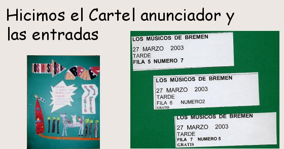

# 1.1 Actividades en los Proyectos de Trabajo

Si en la anterior etapa uníamos el mundo de lo real con el mundo de la imaginación mediante el descubrimiento, análisis y comparación de ambos ámbitos; ahora nos **centraremos en el mundo imaginario** para ahondar en sus características a través de la narrativa que nos ofrecen los cuentos, historias y leyendas.

Canalizar la imaginación de los niños para que sepan materializar su inventiva, es una de las misiones que tenemos como docentes. Hay un momento en el aula que utilizamos para que nuestro alumnado memorice y se exprese, pero deben haber otros para que sean ellos mismos los **protagonistas de su propia narración.** Si ellos tienen una estructura mental clara de cómo funciona una narración, estarán en condiciones –siempre con la colaboración del docente y sus compañeros- de ser autor o autora de la suya propia.

fig. 4.4 Actividad en un P.Trabajo del CEIP Hilarión Gimeno

## Pregunta de Elección Múltiple

### Pregunta

¿Qué pretendemos con este tipo de actividades?

#### Respuestas

[Opción 1](#answer-16_5)

Que nuestro alumnado mejore su creatividad.

[Opción 2](#answer-16_134)

Que nuestro alumnado mejore su expresión oral.

[Opción 3](#answer-16_140)

Las dos opciones anteriores son válidas.

#### Retroalimentación

A través de una actividad podemos trabajar varios objetivos. En nuestro caso damos prioridad a la expresión oral y, en la mayoría de los casos, a la creatividad.

A través de una actividad podemos trabajar varios objetivos. En nuestro caso damos prioridad a la expresión oral y, en la mayoría de los casos, a la creatividad.

**¡CORRECTO!** A través de una actividad podemos trabajar varios objetivos. En nuestro caso damos prioridad a la expresión oral y, en la mayoría de los casos, a la creatividad.

#### Solución

1.  [Incorrecto](#answer-16_5) ([Retroalimentación](#sa0b16_2))
2.  [Incorrecto](#answer-16_134) ([Retroalimentación](#sa1b16_2))
3.  [Opción correcta](#answer-16_140) ([Retroalimentación](#sa2b16_2))

### Pregunta

¿Tienen que servir todas las actividades para profundizar en el proyecto?

#### Respuestas

[Opción 1](#answer-16_143)

Sí, pues de otro modo no tendrían sentido.

[Opción 2](#answer-16_146)

No, porque, aunque no tengan nada que ver, si son buenas deberíamos hacerlas..

[Opción 3](#answer-16_163)

Las dos opciones anteriores son válidas.

#### Retroalimentación

**¡CORRECTO!** Si una actividad no sirve para ahondar en el proyecto, por muy interesante que sea, no podemos incluirla en el mismo. No habría ningún problema en realizar lafuera del proyecto.

Si una actividad no sirve para ahondar en el proyecto, por muy interesante que sea, no podemos incluirla en el mismo. No habría ningún problema en realizarla fuera del proyecto.

Si una actividad no sirve para ahondar en el proyecto, por muy interesante que sea, no podemos incluirla en el mismo. No habría ningún problema en realizarla fuera del proyecto.

#### Solución

1.  [Opción correcta](#answer-16_143) ([Retroalimentación](#sa0b16_128))
2.  [Incorrecto](#answer-16_146) ([Retroalimentación](#sa1b16_128))
3.  [Incorrecto](#answer-16_163) ([Retroalimentación](#sa2b16_128))

