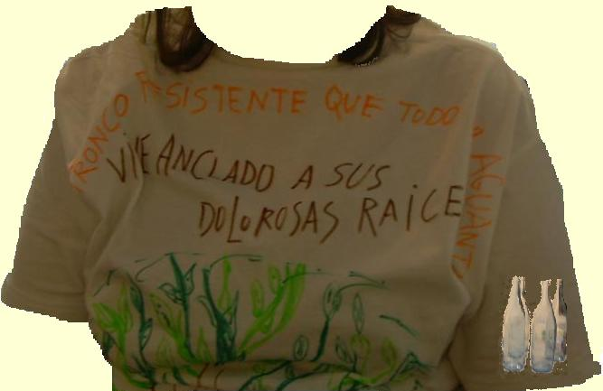

# 1.1 La evaluación en los Proyectos de Trabajo

Si consideramos que el Proyecto está finalizado, es hora de cerrarlo, y la mejor manera será mediante su evaluación. **Evaluar** según la RAE es “_Estimar los conocimientos, aptitudes y rendimiento de los alumnos_. **3.** tr.”. En Educación Infantil no necesitamos una prueba que, a modo de barita mágica, nos descubra los puntos fuertes y débiles de nuestros alumnos. Y no la necesitamos porque es a lo largo del proceso de aprendizaje cuando vamos observando el nivel de esos conocimientos y aptitudes.

  fig. 6.3 Camiseta, soporte de una evaluación personal. EPR

Nos alejamos, por tanto, de la calificación, que sólo pretende “_j__uzgar el grado de suficiencia o la insuficiencia de los conocimientos_”, para acercarnos a una evaluación **como parte del proceso** de aprendizaje. Así, pues, lo más importante será hacer conscientes a los niños de su propio aprendizaje mediante **preguntas como**:

*   ¿Para qué nos sirve investigar esto?
*   ¿Dónde, cómo, con quién lo hemos aprendido?.
*   ¿Qué hemos aprendido? Lo escribimos, dialogamos con el dossier, retomamos conversaciones para contrastar con las ideas previas y verificar errores (yo antes pensaba qué... y ahora que...).
*   Preguntas que favorezcan y hagan aflorar los sentimientos: ¿qué ha sido lo más difícil o agradable?
*   ¿Por qué es importante aprender? Lo intelectual pero también la construcción de la propia identidad.

Finalmente, y si las circunstancias lo permiten, el docente puede **transferir** lo aprendido a un nuevo contexto, lo que posibilita la reconstrucción de la trayectoria desde otros lugares, diferente a repetir.

