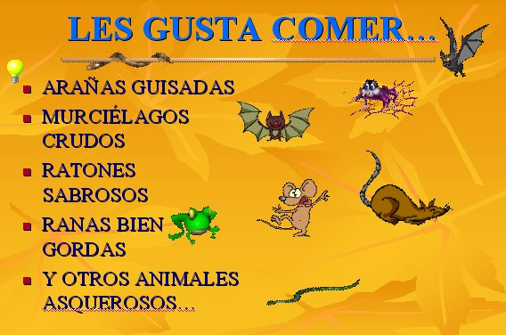

# 1.1 La utilización de las TIC en los Proyectos de Trabajo

Si las TIC suponen la herramienta, desarrollar un proyecto de trabajo será la metodología. Ésta  atenderá al esquema clásico de los proyectos, pero flexibilizándolo a las características del alumnado y la propia idiosincrasia del profesorado.

Aunque buena parte del profesorado de Infantil trabaja por proyectos, no te preocupes si éste no es tu caso. Si quieres saber más sobre los proyectos o, tal vez, deseas refrescar lo que sabes, pincha [aquí;](http://aularagon.catedu.es/materialesaularagon2013/ticinfantil/proyectodetrabajo.pdf) y siempre con la idea de que adaptes todo a tu forma de trabajar. Si, por el contrario, eres un experto en esta forma de trabajar, no te escandalices por nuestra manera de llevar el proceso. **Flexibilizar**, tanto para unos como para otros, será la palabra clave.

   

Como podrás darte cuenta, para hacer un proyecto de trabajo no se necesita necesariamente  la **aportación de las TIC**. Esto es obvio, como también lo es que estamos trabajando con niños y niñas del siglo XXI, alumnado que requiere materializar en la escuela el mundo tecnológico que le rodea. Aparte de esto, las TIC proporcionarán un medio más motivador y con más contenido que el que pueda haber en la inmensa mayoría del material con el que trabajan.

A través de las diversas herramientas que vas a utilizar en este modulo, y en posteriores, vas a exponer a tu alumnado **la información** necesaria para desarrollar el proyecto de trabajo; y lo vas a hacer **en un doble sentido**:

1-     El docente busca, selecciona y prepara la información para mostrársela a su alumnado para que vayan trabajándola.

2-     El docente recoge la información traída, seleccionada y destacada por su alumnado para elaborarla, usando una herramienta TIC, y devolverla a los niños y niñas a modo de afianzamiento de una información que ya se ha convertido en conocimiento.

## Pregunta de Elección Múltiple

<quiz name="">
    <question>
        
Surgida la pregunta, ¿cuál es el primer paso que pedimos a nuestros alumnos?

        <answer>Nos deben decir lo que quieren saber.</answer>
        <answer correct>Nos deben decir lo que saben acerca de lo que se va a investigar.</answer>
        <answer>Debemos responderla</answer>
        <explanation>Debemos partir siempre de los conocimientos previos de nuestro alumnado. Es la mejor manera de marcar la zona próxima de desarrollo de un aprendizaje.</explanation>
    </question>
    <question>
        
¿Quién decide lo que se va a investigar en un proyecto de trabajo?

        <answer>Los alumnos</answer>
        <answer>La maestra</answer>
        <answer correct>Las dos opciones anteriores son buenas.</answer>
        <explanation>Lo ideal es que sean los propios niños y niñas los que determinen qué se va a investigar. Sin embargo, no debemos escandalizarnos si es la maestra la que determine el principio del proceso.</explanation>
    </question>
</quiz>

