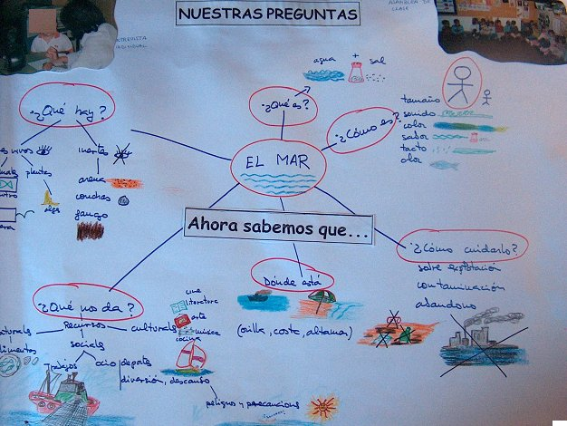

# 1.1 Reelaborar en los Proyectos de Trabajo

Como vimos en el anterior módulo, **reelaborar** la información es la parte última del tratamiento de la información. Aunque Reelaborar  según la RAE es “_Volver a elaborar algo_”., no es tiempo de hacer lo mismo, sino de trabajarlo desde otra perspectiva para profundizar en su esencia.

Nuestra misión, ahora, es llevar a nuestro alumnado por caminos de relación que, en nuestro caso, están vinculados con el mundo de lo imaginario. Esta relación entre el mundo de lo real –trabajado en loss anteriores módulos- y el mundo imaginario nos debe llevar a que el niño y la niña sean más conscientes a la hora de distinguir uno y otro. ¿Y cómo lo haremos? Sobre todo descubriendo, analizando y comparando ambos ámbitos.

 

## Pregunta de Elección Múltiple

<quiz name="">
    <question>
        
¿Qué pretendemos con la reelaboración del proyecto?

        <answer>Hacer un nuevo proyecto de trabajo.</answer>
        <answer correct>Profundizar en nuestro proyecto confrontándolo a otras realidades.</answer>
        <answer>Las dos opciones anteriores son válidas.</answer>
        <explanation>Realmente un Proyecto de Trabajo cuando se contesta la pregunta clave, pero en ese proceso podemos encontrarnos con nuevas interrogantes que nos lleven en un futuro a abrir nuevos proyectos. Nosotros forzaremos está situación al enfrentar nuestro proyecto a la información surgida con la aparición del mundo de lo irreal.</explanation>
    </question>
    <question>
        
¿Para qué nos pueden servir las actividades a través del formulario?

        <answer>Para sintetizar la información.</answer>
        <answer>Para evaluar el proceso de aprendizaje del alumnado.</answer>
        <answer correct>Las dos opciones anteriores son válidas.</answer>
        <explanation>Los objetivos pueden ser varios, todo dependerá de los aspectos que queramos resaltar más.</explanation>
    </question>
</quiz>
