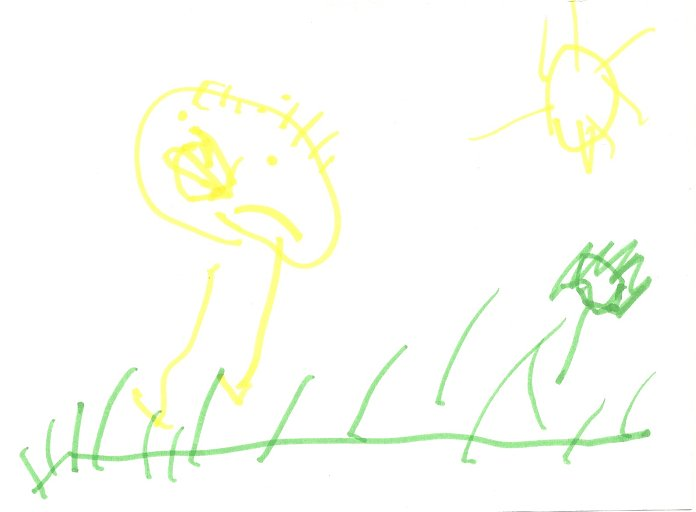

# 1.2 Nuestro Proyecto de Trabajo

La **reconstrucción del proceso**, como evaluación, favorece la interiorización de los conocimientos y de las estrategias empleadas. Para ello, deben reflexionar utilizando las conversaciones y actividades que se han realizado a lo largo de todo el proyecto: desde el mundo real al mundo imaginario..

Debemos **seleccionar  imágenes significativas** del salto cualitativo del aprendizaje. Una vez seleccionadas, debemos mostrarlas en la asamblea y lanzar **preguntas** como las vistas en el punto 1.1. y que completamos con algunas relacionadas con el mundo de los animales:

 

 fig. 6.4 Dibujo 3 años"He perdido a mi mamá" Vanesa Calvo

*   ¿Por qué escogimos los animales de la granja? ¿Qué nos interesaba saber?
*   ¿Qué relación hay entre estos animales y los seres humanos?
*   ¿Qué pueden sentir los animales de la granja cuando los explotan las personas? ¿Cómo lo sabes?
*   ¿Qué semejanzas y diferencias físicas y de carácter ves entre ellos y nosotros?
*   ¿Qué tiene que ver un cerdo real con la historia de “Los tres cerditos”? ¿y el lobo?
*   Los tres cerditos eran diferentes, ¿y las personas somos diferentes?
*   ¿En que se diferencian/parecen los cuentos y la vida real?

## Pregunta de Elección Múltiple

### Pregunta

1\. ¿Se pueden contestar con un SÍ/NO la mayoría de las preguntas que aparecen en el apartado de arriba?

#### Respuestas

[Opción 1](#answer-48_5)

Sí, porque las respuestas son breves.

[Opción 2](#answer-48_196)

No, son más interesantes las preguntas abiertas porque tienden a la reflexión.

#### Retroalimentación

¡INCORRECTO! Las preguntas abiertas tienden más a la reflexión, a investigar nuevos campos, a plantearnos nuevos proyectos.

¡CORRECTO! Las preguntas abiertas tienden más a la reflexión, a investigar nuevos campos, a plantearnos nuevos proyectos.

#### Solución

1.  [Incorrecto](#answer-48_5) ([Retroalimentación](#sa0b48_2))
2.  [Opción correcta](#answer-48_196) ([Retroalimentación](#sa1b48_2))

### Pregunta

2- ¿Evaluar es preguntar?

#### Respuestas

[Opción 1](#answer-48_205)

Sí, porque es la única forma de descubrir lo que sabe nuestro alumnado.

[Opción 2](#answer-48_208)

No, evaluar es conocer en qué punto del proceso de aprendizaje se encuentran nuestros alumnos.

#### Retroalimentación

Evaluar es un largo proceso que no se cierra ni en una pregunta, ni en una actividad, ni en una parrilla de observación, aunque todo esto nos facilitará la evaluación.

¡**CORRECTO**! Evaluar es un largo proceso que no se cierra ni en una pregunta, ni en una actividad, ni en una parrilla de observación, aunque todo esto nos facilitará la evaluación.

#### Solución

1.  [Incorrecto](#answer-48_205) ([Retroalimentación](#sa0b48_202))
2.  [Opción correcta](#answer-48_208) ([Retroalimentación](#sa1b48_202))

### Pregunta

3- ¿Y si nuestro proyecto no ha respondido a la pregunta clave?

#### Respuestas

[Opción 1](#answer-48_236)

El proyecto no ha acabado

[Opción 2](#answer-48_239)

Hemos fracasado

#### Retroalimentación

¡**CORRECTO**!Nunca hay un fracaso, tan sólo una demora en encontrar las respuestas correctas. Que no hayamos acabado el proyecto no significa que, si la situación lo requiere, no podamos posponerlo para otro momento.

¡INCORRECTO!Nunca hay un fracaso, tan sólo una demora en encontrar las respuestas correctas. Que no hayamos acabado el proyecto no significa que, si la situación lo requiere, no podamos posponerlo para otro momento.

#### Solución

1.  [Opción correcta](#answer-48_236) ([Retroalimentación](#sa0b48_233))
2.  [Incorrecto](#answer-48_239) ([Retroalimentación](#sa1b48_233))

