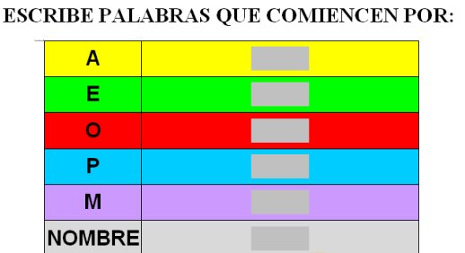

# 1.3 Las TIC en nuestro Proyecto de Trabajo

Os recordamos que en esta fase usaremos algunos de los vídeos que seleccionamos en el Módulo 1, y que tan bien guardados estaban. Con todo lo ya hecho durante el proyecto de trabajo y con el visionado de esta pequeña **galería de vídeos** de cuentos, historias o leyendas, debemos hacer que el alumnado analice las diferencias y semejanzas entre el mundo de lo real y el mundo de la imaginación.

Con el trabajo realizado a través de actividades hechas en la asamblea, en pequeños grupos o individualmente, el docente recogerá lo más importante y hará un **Formulario** que sirva para afianzar el proceso de aprendizaje de sus alumnos 

Nuestro formulario, al ser destinado para niños de Ed. Infantil, tendrá que llevar **imágenes que apoyen** la lectura y comprensión del texto; y un diseño que atraiga el interés del alumnado.

Lo más importante será que sirva a vuestro alumnado, y lo de menos la **herramienta** que elijáis para la realización del formulario (ver U2.2)

 

