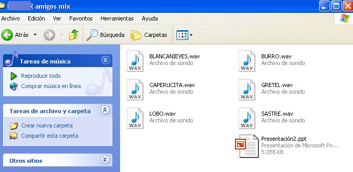

# 2.1.1 El sonido

Del módulo anterior ya tienes preparados los archivos de sonido con las voces de tus alumnos. Aunque ciertos editores de presentaciones como, por ejemplo, Power Point, sólo admiten incrustar archivos “.wav”, no te asustes porque sí permiten **vincular** –y esto es lo que nos interesa-  todos los demás tipos de archivos multimedia. Por tanto, vas a poder trabajar perfectamente con la extensión “mp3”.

  
Para terminar este primer paso previo antes de empezar con el editor de presentaciones, te rogamos encarecidamente que tus archivos de **sonidos estén en la misma carpeta donde vayas a guardar tu documento de presentación**. De lo contrario, tus sonidos no se van a oír porque al romperse la vinculación todo lo que hayas hecho anteriormente no será encontrado por el programa.

 fig. 5.10 Carpeta con ppt y archivos de sonido. CPP

Tal como dijimos en el apartado 2.3.1 del Módulo 4, es importante que trabajes con archivos de sonido que no pesen mucho, como, por ejemplo, **Mp3**. Los archivos **.wav** son de mejor calidad, pero están sin comprimir y pesan más. Si tus grabaciones todavía están guardadas en .wav, vuelve al mencionado apartado 2.3.1 y léete el texto sobre los  **conversores ****de formatos de audio.**

