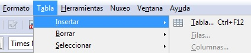
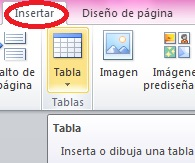
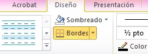
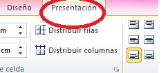
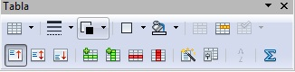

# 2.1.2 Las tablas

Usamos tablas para crear formularios porque permiten organizar la información en filas y columnas, y diseñar los documentos al facilitar la distribución de textos e imágenes.

En TIC, como en otros órdenes de la vida, nos podemos encontrar con varias opciones válidas para realizar una acción. Así, por ejemplo, a la hora de **insertar** una tabla desde **Word** podemos:

*   Opción del menú “_Tabla_” y, seguidamente, “_Insertar Tabla_” 
*   Pinchar sobre el icono “_Pinchar tabla_”

Y desde **Writer**, todavía más fácil: "Tabla" e "Insertar"

A partir de aquí puedes seguir el videotutorial de [Martín de la Vega](http://www.youtube.com/watch?v=sgV6N3pHjqI "Tutorial sobre Tablas de Martín de la Vega") para **Word** 2007\. Pero si quieres un tutorial en "papel" te recuerdo los de [aulafácil](http://www.aulafacil.com/word-2007/word-2007/Temario.htm "Procesador de textos. Aulafacil.com")  (unidad 8) y [Elier José Orellana Rodríguez](http://www.slideshare.net/elierorellana/tutorial-de-word-2007-aulaclic "Slide sobre Word. Elier José Orellana") (L29 y 30). 

   

Esmérate en el **diseño** de las tablas: color de relleno, bordes, tipo, tamaño y color de la letra, imágenes, etc.

   

Y si prefieres usar **Writer** de OpenOffice mírate las pgs. 30 a 32 del tutorial de  la [ Junta de Andalucía](http://www.juntadeandalucia.es/averroes/manuales/materiales_tic/unit00/index_archivos/ayudas/Manual_OO_Writer.pdf "Tutorial Openoffice Junta Andalucía"). Tiene la ventaja de que todas las funciones de las tablas están incluidas en la misma ventana.

    

Antes de que pases al siguiente punto **recuerda** que:

*   Antes de hacer el formulario debes crear la tabla.
*   Hacer actividades con tablas no es hacer formularios, por muy bonitas que queden aquellas.

