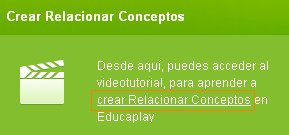
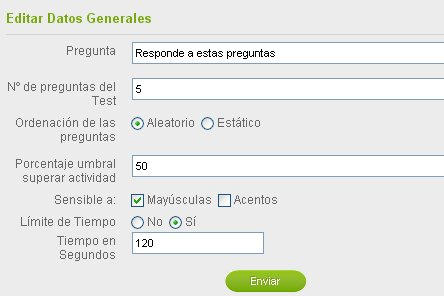
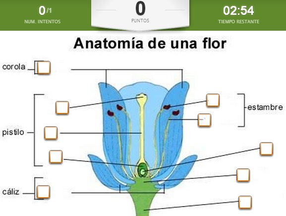

# 2.1 Educaplay: una alternativa on-line

[Educaplay](http://www.educaplay.com/ "Web oficial de Educaplay") proporciona herramientas para crear actividades educativas on-line, y permite compartirlas con otros usuarios dentro del mismo portal. Para poder acceder a sus herramientas es preciso [registrarse](http://www.educaplay.com/es/registrar.php?action=registrar "Página para registrarse en Educaplay"). Una vez cumplimentado el formulario ya estás registrado, sólo es cuestión de que no olvides tu contraseña porque ésta y tu cuenta de correos se te pedirán para acceder. 

A continuación te resumimos sólo los pasos más importantes que debes seguir para realizar las actividades. Como verás, Educaplay es muy intuitivo de uso, de todas formas, para mayor información mírate lo que te interese del [tutorial ](http://es.scribd.com/doc/92816435/Tutorial-PDF-Educaplay "Tutorial Educaplay. Jose Jaco")de Jose Jaco. 

Una vez conectado, Educaplay nos lleva a elegir entre ver las **actividades** creadas "_Mi Educaplay_" o "_Crear actividad" (pg.16)_. Si escoges esta última opción se te abrirá una ventana donde podrás elegir entre crear mapas, adivinanzas, actividades de completar, crucigramas, diálogos, dictados, ordenar letras, palabras y palabras, relacionar, sopas de letras o test (pgs. 26-63). De todas formas, también puedes crear actividades pasando el ratón por el menú de "_Actividades_"

Cuando elijas una actividad se abrirá una **página informativa** donde encontrarás explicación sobre en qué consiste dicha actividad, un hipervínculo para acceder a un banco de recursos y, lo más interesante para los que empiezan, un video tutorial a la derecha de la pantalla.

 

Es hora de **publicar** lo que has hecho. Así, cuando termines de hacer la actividad, tendrás que pinchar sobre "_Editar_". Se abrirá una ventana, rellena la información y pincha sobre "_Enviar_". Desde ese momento, tu actividad quedará colagada en la red.

Si quieres que alguien **vea la actividad** que has creado, **sin necesidad de entrar directamente en la página** de Educaplay, lo único que tienes que hacer es **mandarle la** **URL** que aparece en el panel de la derecha de cada actividad (pgs.119-120). Recuérdalo para cuando tengas que hacer el envío correspondiente a tu tutor si has escogido esta herramienta de autor.

Para hacerlo dentro del propio programa (pgs.96-97) sólo tienes que ir a "**_Grupos_**", "_Administración de grupos"_, "_Crear un grupo"_ y pinchar en "_Administrar_". Dentro de "_Administración de grupos_" hacer clic en _"invitar usuarios_" e introducir el correo electrónico de la persona a la que quieres mandar la actividad.

Para ver el resultado final de una actividad, por **ejemplo** de un mapa interacivo, pincha sobre la imagen de la derecha y anímate a hacer una.

