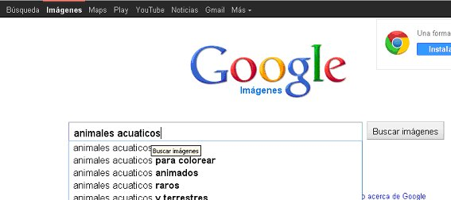

# 2.1 Galería de imágenes

Cuando queremos una imagen mayormente vamos al buscador de [Google](http://www.google.es/), seleccionamos “_Imágenes_” y escribimos el nombre del tipo de imagen que queremos antes de pinchar en “_Buscar Imágenes”_. No vamos a renunciar a esta inmensa galería, pero vamos a proponerte que investigues en otras galerías de imágenes, menos conocidas, pero, algunas de ellas, de más calidad y con licencia de uso gratuita.

 

Recuerda el tema y selecciona un amplio abanico de imágenes para que tu alumnado tenga más para elegir. Lo importante es que puedas **dividir las imágenes en grupos o categorías**. En el Proyecto que nos está sirviendo de ejemplo, hemos escogido un grupo de imágenes de animales salvajes, otro de animales domésticos, y otro de animales de la granja. Podríamos haber escogido otro tipo de grupos, y también estaría bien.

Es fundamental ofrecerles para elegir, pero que tampoco haya demasiado entre lo que elegir. Tres o cuatro categorías ya es suficiente.

