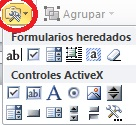
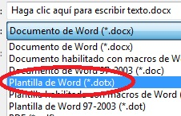

# 2.2.1 El formulario en Word

Antes de empezar, asegúrate de que esté visible el Formulario en la Barra de Herramientas de la parte superior. Para **activarlo** debes seguir los siguientes pasos:

*   Word 2003: pincha en “_Ver_”, “_Barra de herramientas_” y “_Formulario_”.
*   Word 2007: “_Archivo_”, “_Opciones (Más frecuentes)s_”, “_Cinta de opciones_”, te mostrará diversas fichas y haz clic sobre la casilla de “_Programador_”

fig. 3.15 Tipos formularios. Captura pantalla propia.

Entre las **actividades** básicas que te encontrarás están:

1.  Campo de texto
2.  Casilla verificación
3.  Lista desplegable
4.  Radio botones

Para la versión **2003** te recomendamos estos vídeo-tutoriales de Javier Santamás ([I,](http://www.youtube.com/watch?v=1FhoVUMBezM "Formularios en Word 2003") [II](http://www.youtube.com/watch?v=UZPco4KfcEU "Video tutorial Formularios Word 2003"), [III](http://www.youtube.com/watch?v=_DE3BIb7nJk "Video tutorial Formularios Word 2003")). Y para la versión **2007** los dos video-tutoriales de Iván Salixar ([I](http://www.youtube.com/watch?v=lB4CcCkQi5c&feature=related "Video tutorial Formularios Word 2007") y [II](http://www.youtube.com/watch?v=iNY2B3ouzdM&feature=related "Video tutorial Formularios Word 2007")).

Utilices la versión que utilices, ten cuidado y [**protege el formulario/restringe edición**](http://www.aulaclic.es/word2007/t_19_7.htm "www.aulaclic.es") contra la escritura antes de Guardar. De esta forma te aseguras que tus alumnos sólo escriban donde a ti te interesa que lo hagan.

A la hora de **guardarlo**, hazlo como una plantilla. De esta forma, tus alumnos podrán rellenar el formulario y guardar lo que hayan hecho como un documento normal.

 

fig. 3.16 Guardar como plantilla. CPP

