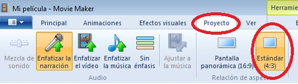
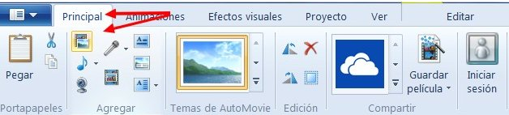
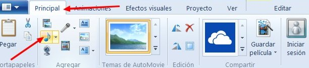
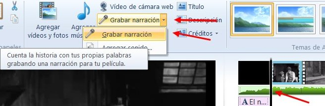
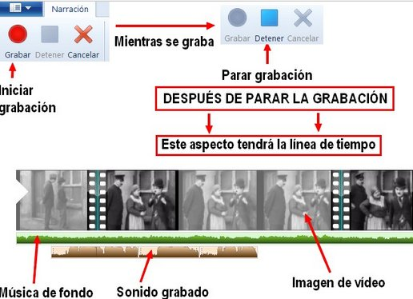
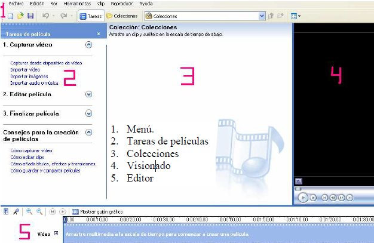
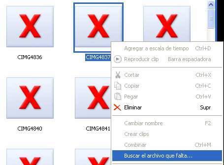

# 2.2.1 Imágenes, vídeos y sonidos

>**danger**
> [Windows Movie Maker ya no está disponible para la descarga](https://support.microsoft.com/es-es/help/4054502/windows-10-movie-maker-is-no-longer-available-for-download). Por ello, las siguientes indicaciones sólo podrás seguirlas si tienes ya instalado Windows Movie Maker en tu ordenador.
> Si tienes Windows 10 puedes realizar la última tarea de este curso utilizando el software **Fotos** que viene instalado.
> También puedes utilizar el software libre galardonadoo y multiplataforma [**Open Shot**](https://www.openshot.org/es/).

Una vez hayas abierto el programa, es momento de explorar todas las herramientas que te ofrece este programa en el **"Panel de control**".

  

Importamos todas las fotos y música a nuestro proyecto de edición.Aunque no hay un **orden** fijo **para trabajar en la edición**, no estaría mal que tuvieras en consideración estas **recomendaciones**:

1.  Colocamos los archivos de imagen en la línea de tiempo.
2.  Insertamos efectos, transiciones y textos.
3.  Importamos los sonidos.
4.  Sincronizamos sonidos e imágenes. Si esto no te interesa, puedes insertar los sonidos cuando quieras.

*   **Abre Windows Movie Maker** y crea un proyecto nuevo.
*   **Configura el proyecto**: Solamente tienes que elegir el formato de pantalla. En este caso vamos a elegir la pantalla de **4:3** (cuatro tercios). Clic en la pestaña **Proyecto** y elegir **Pantalla Estándar** (4:3).

 

**1\. Insertar clip de vídeo o imagen**

1º En la ventana principal hacemos clic en "**Agregar fotos o vídeo**".

2ª En la ventana que sale seleccionamos el primer vídeo o imagen. Podemos hacerlo **de uno en uno** o **agregando todos a la vez**. Para agregar todos a la vez pulsamos la tecla Mayúsculas a la vez que clic con el ratón en el primer archivoy sin soltar la tecla clic en el último vídeo. Clic en Añadir.

 

**2\. Agregar un clip de sonido**

1º En la pestaña principal, clic en **Agregar música**.

**3º Narraciones de audio**

*   En la **ventana principal**, colocamos el ratón en el lugar (clip de vídeo) que queremos situar el sonido.

*   Clic en **Grabar Narración**. Aparecerá otro botón para parar la grabación. Cuando paramos, nos pedirá **grabar el sonido en una carpeta**, lo hacemos. Ya tenemos **grabadas las narraciones**.

4º **Guarda la película.**

   

Las funciones que hemos tratado hasta ahora, y las que trataremos en los dos siguientes subapartados, las puedes ver explicadas en el **tutorial** de la izquierda

## ** Versiones anteriores a 2012**

   

Lo ideal sería que utilizaras la versión de 2012, pero, si por la razón que sea, prefieres trabajar con alguna versión anterior, observarás en la imagen que puedes trabajar desde el menú principal. De todas formas, lo más cómodo es hacerlo desde la banda izquierda de “_Tareas de películas_”, que se activa desde . Desde aquí podrás importar vídeo, imágenes o audio.

**1\. Insertar imágenes y vídeos**. Lo único que tienes que hacer es pinchar sobre “_Importar imágenes_”. La imagen aparecerá como clip en el  espacio central de colecciones y  lo único que queda es arrastrarla y soltarla en la línea del tiempo sobre la pista de vídeo y determinar la duración. Podrás seleccionar varias imágenes a la vez si mantienes presionada la tecla de mayúsculas.

**2\. Insertar** **sonidos. S**igue el mismo procedimiento que para las imágenes. Ya sólo es cuestión de que los arrastres a la zona de edición.

Se supone que durante el proyecto hemos trabajado con archivos de imagen, y no de vídeo. Si hubieras hecho esto último, no te preocupes, todo lo contrario, porque podrás utilizarlo entero, dividirlo o extraer imágenes fijas de los mismos. Fíjate en los botones de la parte baja de la zona de visionado.

Mientras estás editando, sonidos e imágenes se insertan al programa, pero no se incrustan. Esto quiere decir que dichos **archivos no debes cambiarlos de carpeta**, por lo menos hasta que finalices la película. En estos casos te aparecerá la imagen de X rojas sobre fondo azul. Para que aparezcan las imágenes haz clic con el botón derecho y pincha Buscar el archivo que falta. Si no lo encuentras automáticamente, habrá que llevarlo manualmente hasta el archivo origen. Una vez hayas finalizado la edición de la película, todos los archivos quedarán incrustados a la misma y los originales ya no serán necesarios.

  

Antes de incluir transiciones, efectos o créditos te recomendamos tengas ya insertadas las imágenes, vídeos y sonidos. Y no te molestes en hacer ningún tipo de sincronización entre sonidos e imágenes hasta que hayas incluido las transiciones y los créditos. No hacerlo nos asegura que la **sincronización** que tanto nos ha costado desaparezca.

Movie Maker es muy intuitivo, pero si quieres ir a lo seguro léete el **tutorial** de [aularagon  ](http://aularagon.catedu.es/materialesaularagon2013/ticinfantil/moviemaker.pdf "tutorial Movie Maker. Aularagon")y detente en los apartados que acabamos de ver:

*   Vídeos                                                    pgs. 11,12
*   Imágenes: importar, organizar y cortar clips   pgs. 14 a 17
*   Modificar la línea del tiempo                        pg. 17
*   Archivos de sonido                                    pgs. 21,22

