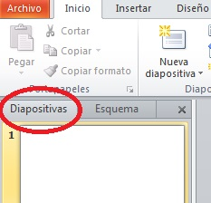
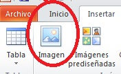
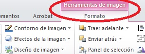

# 2.2.1 Insertar texto e imágenes

# **Texto**

Una vez abierto el programa e introducida una Nueva Presentación, el programa nos dará a elegir entre varias plantillas para ahorrarnos trabajo. Elige la más conveniente, aunque sabiendo que su formato se puede modificar mientras trabajamos en la diapositiva. Ahora sí que estamos en disposición de insertar texto. Podemos trabajar un texto desde la pestaña “_Esquema_” o desde la pestaña “_Diapositivas_”. Te será más fácil por su mayor atractivo visual, hacerlo desde “_Diapositivas_”.

   fig. 5.13 Trabajar en modo diapositiva en Power Point. CPP

A la hora de escribir es como otro cualquier editor de texto. Cuida, por tanto, el **formato del texto**: letras de tamaño suficiente para ser vistas fácilmente, color que contraste con la imagen que esté al fondo, etc.

## **Imágenes**

Las **fuentes** de las imágenes que insertes (menú "_Insertar_") en tu presentación pueden ser principalmente:

*   Imágenes prediseñadas que hay dentro del mismo programa.
*   Imágenes de una página web.
*   Imágenes de un archivo que tienes en tu ordenador y/o memoria.

Se supone que con este último tipo es con el que vas a trabajar, porque todas las imágenes escaneadas de los dibujos de tus alumnos estarán guardadas en alguna carpeta de tu ordenador.

  fig. 5.14 Insertar imagen en Power Point. CPP

  fig. 5.15 Formato de imagen en Power Point. CPP

Una vez hayas insertado la imagen en la diapositiva, pinchando sobre la imagen se te abrirá un menú de "Herramientas de imagen" para **modificar el formato** de la misma: color, efectos, girar, recortar, estilos, comprimir, etc.

Si lo necesitas, revisa el tutorial del [Catedu](http://www.catedu.es/facilytic/2013/10/11/curso-power-point-2007-de-aularagon/ "Tutorial Catedu sobre Power Point 2007")  (Módulo 3 U1) o échale un vistazo a las recomendaciones para insertar imágenes hechas por la misma [Microsoft](http://office.microsoft.com/es-hn/powerpoint-help/insertar-una-imagen-o-una-imagen-predisenada-HA010079409.aspx?CTT=1 "Tutorial para insertar imágenes en Power Point")

**Comprimir imágenes**

Después de haber insertado todas las imágenes, podrás observar que el documento creado/guardado pesa más (tiene más MBs). Dependiendo del caso, podrías tener problemas cuando mandes la presentación a tu tutor. Para solucionarlo desde el propio programa sería interesante que  pincharas sobre cómo [comprimir imágenes](http://office.microsoft.com/es-hn/powerpoint-help/reducir-el-tamano-de-archivo-de-una-imagen-HA102749391.aspx?CTT=1 "tutorial para comprimir imágenes").

Si tomas una foto de tus alumnos con una cámara digital puedes generar un archivo de 800x600 pixeles y un 1,5Mb. Si escaneas los dibujos de tus alumnos prueba la resolución de 800 píxeles de ancho, pero el resultado final no debería ocuparte más de 200Kb.

Si quieres comprimir una imagen para utilizarla con otra herramienta, te hacemos dos **recomendaciones** -aunque hay muchas más:

fig. 5.16 Logo MediaFire. Web oficial

Programa fácil de instalar en el ordenador y muy intuitivo en su uso. Para **descargarlo**, pincha sobre el logo de arriba, y si quieres una guía explicativa, haz clic en el **tutorial.**

  fig. 5.18 Video Tutorial sobre compresor imágenes MediaFire. ImpaktoperuHD.   Youtube

fig. 5.17 Cartel Web Resizer

Para comprimir imágenes a través de la red sin necesidad de descargar nada. Si ves el **tutorial** adjunto, verás que es extremadamente fácil de usar.

   fig. 5.19 Video Tutorial sobre Web Resizer. Héctor Hugo Luna. Youtube

