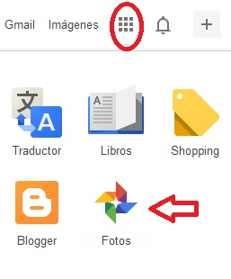

# 2.2.2 Google Fotos

 

En el mundo virtual  de Google están surgiendo muchas herramientas 2.0.  La que te presentamos es una **adaptación** sencilla **de Picasa** para que los usuarios puedan realizar algunas de sus funciones sin necesidad de tener dicho programa en su ordenador. De Google Fotos no vamos a ver todo, sólo aquello que interesa para desarrollar nuestra tarea: subir fotos, crear  y mandar álbumes.

Sigue los pasos del siguiente [tutorial](https://www.youtube.com/watch?v=jYrfl_ylI7M "Tutorial google drive fotos") y correrás el riesgo de convertirte en un forofo o forofa de Google Fotos.

Si recuerdas por el [apartado 2.2.1,](221_picasa.md) es imprescindible que tengas una **cuenta en gmail**. De no ser así, pincha en el [**tutorial para crear una cuenta.**](http://facilytic.catedu.es/2013/10/09/crea-una-cuenta-de-gmail/ "Tutorial abrir cuenta en gmail. Argentina Trabaja") Aunque este requisito es imprescindible para trabajar, puedes enviar tus fotos y/o álbumes a cualquier cuenta de correo que no sea gmail.

Como en muchas aplicaciones, en ocasiones hay diversas maneras de realizar una misma función. Nosotros te mostramos algunas y eres libre para elegir la que quieras o seguir otros caminos

