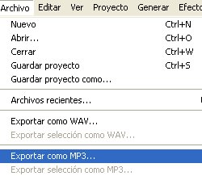

# 2.2.2 La exportación de sonidos

El proyecto completo se **guarda en formato AUP,** que nos servirá para abrir el archivo desde Audacity y modificarlo en un futuro. Para guardarlo iremos a “_Archivo_” y seleccionaremos “_Guardar proyecto_”.

Si consideras que lo editado está listo para **exportar** y no necesitarás hacer modificaciones en el futuro, no es necesario que lo guardes como proyecto y puedes ya exportarlo directamente. Exportar permite que otras personas, sin necesidad de que tengan Audacity, puedan oír lo que hemos editado. Para exportar vamos a “_Archivo_”, “_Exportar_” y elegimos el formato. Te recomendamos que lo exportes en MP3 porque te va a ocupar mucho menos que en WAV. No olvides lo que hemos dicho sobre los codificadores en el apartado [2.2](22_audacity.html)

 Fig. 4.14 Exportar como MP3 en Audacity. Captura de pantalla propia

