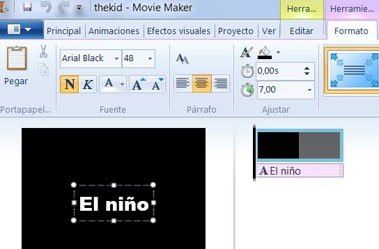
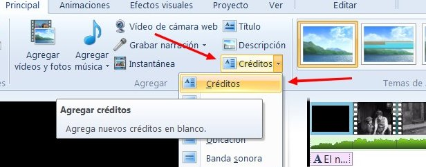
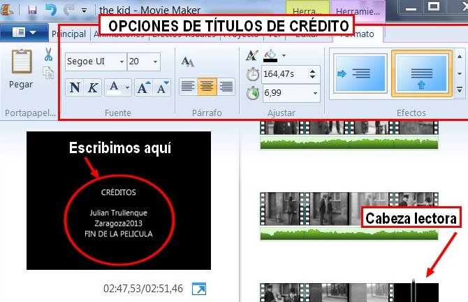
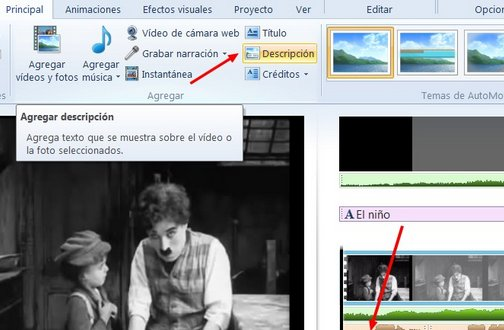
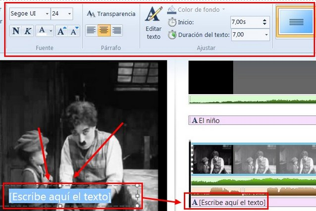
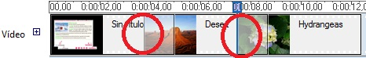

# 2.2.2 Transiciones, efectos y créditos

**1**. **Transiciones** te permite crear una transición entre el clip que tiene seleccionado y el siguiente clip en la secuencia. Las transiciones permitirán que el clip cambie gradualmente al siguiente.

1.  Clic en el vídeo que quieres la transición. Si quieres ponerla entre el primero y el segundo, tendrás que hacer clic en el segundo vídeo.
2.  Clic en la pestaña **Transición**. Eliges la que más te guste. Podrás elegir la duración de la transición.

**2\. Ponemos un título**

1.  Clic en la ventana **Principal**.
2.  Clic en el botón **título**. Aparecerá un** cuadro de diálogo** en el que podemos elegir:

*   Tipo de** fuente** (tamaño, fuente, negrita...)
*   Ajustes de **párrafo** (transparencia, justificación). 
*   **Ajustar**: color de fondo, editar texto, duración.
*   **Efectos**: movimientos del título y efectos del texto (contorno).

fig. 6.23 Insertar título. Captura de pantalla propia de Julián Trullenque 

**2\. Títulos de crédito**

*   Casi tenemos nuestra película terminada, vamos a poner unos **títulos de crédito**. Haz **Clic** en **Créditos**.

fig. 6.24 Insertar créditos. Captura de pantalla propia de Julián Trullenque

*   **Escribimos los títulos** y seleccionamos las **opciones** que más nos gusten.

fig. 6.25 Opciones de títulos de crédito. Captura de pantalla propia de Juliánr Trullenque

 **3**. **Subtitular la película**

*   No situamos **con el ratón en el clip que queremos subtitular**.
*   En la ventana Principal hacemos **clic en Descripción**.

fig. 6.25 Subtitular. Captura de pantalla propia de Julián Trullenque

*   Nos aparecerá esta **ventana de edición del título**. Escribimos el título y elegimos las opciones.

fig. 6.26 Edición subtítulos. Captura de pantalla propia de Julián  Trullenque

Versiones anteriores a 2012

Es la hora de insertar **transiciones** que faciliten el cambio entre escenas o de introducir **efectos** para variar la imagen de los clips. Utilízalas con moderación para no despistar visualmente al espectador.

fig. 6.27 Transiciones en la línea del tiempo de Movie Maker. CPP

Las **transiciones** tienen la particularidad de que se insertan en una pista especial sobre el final de un clip y el principio de otro. Por tanto, necesita dos imágenes consecutivas. Esta es la razón de que, al igual que los **títulos** y los **créditos**, varía la longitud de la edición.

**Títular diapositivas** en Educación Infantil  nos va a permitir incluir la escritura como un elemento más, como lo puede ser la imagen o el sonido, y darle la naturalidad funcional que requiere su aprendizaje.

