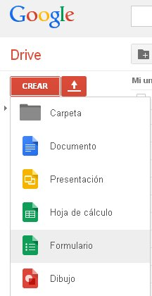
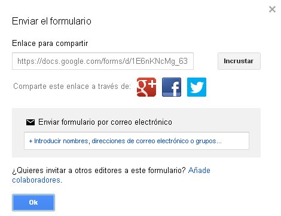
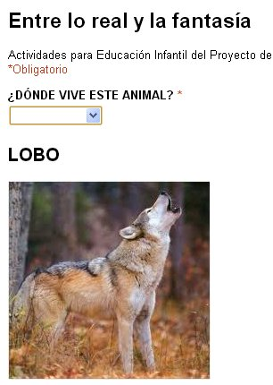

# 2.2.3 El formulario on-line: Google Drive

Te **recomendamos** este tipo de formularios porque quizás sean los más fáciles de aprender y realizar, siendo visualmente atractivos con muy poco trabajo; crean automáticamente una base de datos con las respuestas de los alumnos; e, incluso, permiten añadir vídeos.

Sus **inconvenientes** es que dependemos de una línea de Internet; el monocromo fondo blanco y la vertical visualización; y, por último, necesitas tener una cuenta en [gmail](http://www.gmail.com "Cuenta correo gmail"). Para subsanar esto último, sigue las recomendaciones que hicimos en el Módulo 1.

Si sigues los sencillos y claros pasos del videotutorial de [Amira Argentina](http://www.youtube.com/watch?v=PiUuwYL-9KI "Video tutorial Formularios en Google Drive"), en menos de una hora serás todo un experto en la creación de formularios en Google Drive.

**Consideraciones**:

*   Si introduces algún vídeo, procura que su duración sea corta.
*   No olvides de tildar la casilla de "_Preguntas obligatorias_". Ayudará a que el alumno no haga un formulario incompleto.
*   Si el alumnado trabaja individualmente, enlaza la URL del Formulario a alguna imagen que le sea significativa para hacer clic sobre ella fácilmente

Si te decides a emplear este medio, tendrás que **copiar la URL** del documento para enviársela a tu tutor. Para ello vete al margen superior derecho del Formulario y pincha en “_Enviar formulario"_ y se abrirá la siguiente ventana.

Vete a la casilla “_enlace para compartir_” y cópialo porque será esto lo que tengas que enviar. Si quisieras enviarlo por correo a varias direcciones, escribe la dirección y no olvides poner, justo después, punto y coma (;), darle a la barra espaciadora e  Intro para escribir la siguiente dirección.

 

Si pinchas sobre la imagen verás **actividades** que hemos hecho para nuestro Proyecto de Trabajo. Te será muy fácil mejorarlas en tu propio proyecto. Y recuerda:

*   Elige imágenes de calidad.
*   Titula las imágenes aunque tus alumnos sean muy pequeños.

