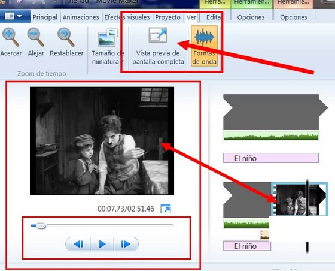
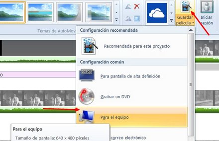
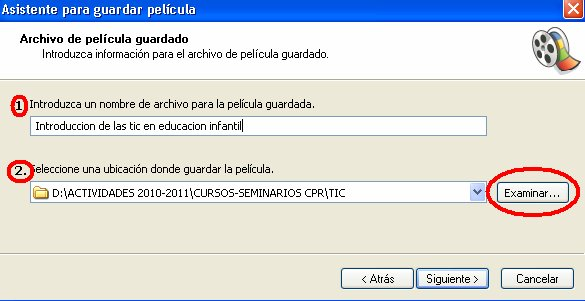

# 2.2.3 Guardar y crear película

**1\. Previsualizar el proyecto**

Antes de de exportar nuestro trabajo, lo **podemos ver todas las veces que queramos**. Hay dos procedimientos para hacer ésto:

1.  En la **ventana previsualización** del entorno de trabajo.
2.  En la pestaña **Ve**r: Clic en **Vista previa de pantalla competa**.

**2\. Crear una película**.

*   Hacemos clic en la pestaña **Guardar Película**.

*   Este programa solamente guarda películas en formato WMA o MPG4

Mientras vas trabajando no olvides **guardar el proyecto** de vez en cuando porque en ocasiones, dependiendo del ordenador que tengas, Movie Maker se puede colgar. Para evitar desgracias vete a “_Archivo_”, “_Guardar proyecto como_”, y se generará un archivo con extensión .MSWMM, que sólo podrás ver en un ordenador que tenga Movie Maker.

# Versiones anteriores a 2012

Cuando hayas **finalizado la edición,** vete a “_Finalizar Película_”, pincha en “_Guardar en el equipo_” y sigue los pasos.

Por defecto Movie Maker te guardará el archivo de la película en **formato** .WMV, que junto al formato .MOV ,RM, y .FLV, es el más adecuado para publicar un vídeo en Internet por su correcta relación calidad/peso. De todas formas, si quieres guardar el video original  para tu propio uso, fuera de la red, lo mejor es el formato .AVI. Ahora sólo te queda verla con tus alumnos y alumnas.

