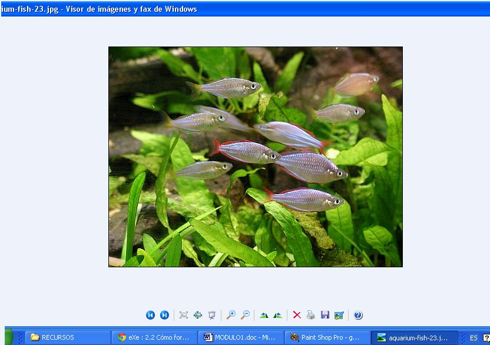

# 2.2 Cómo formar álbumes

**Mostrar un álbum de fotos/imágenes** a nuestros niños, de una manera sencilla y práctica, es muy fácil. Abre la carpeta donde tienes las imágenes seleccionadas, pincha una imagen con el botón derecho del ratón y selecciona "_Abrir con_" "_Visor de imágenes y fax de Windows_"

Puedes **mostrar las imágenes de una manera automática** haciendo clic en "_Iniciar la presentación_". De esta forma las imágenes se verán a pantalla completa. Si quieres pasar una imagen antes del tiempo que marca el automatismo, lo puedes hacer simplemente pinchando dentro de la pantalla.

También puedes **mostrar imágenes de forma manual** pinchando en las dobles flechas situadas abajo, a la izquierda.

Elijas el procedimiento que elijas, asegúrate de que todas tus imágenes están situadas en la misma carpeta.

Como nos interesa que vayas más allá de lo básico, en los dos siguientes subapartados del punto 2.2 te animamos a que aprendas a usar algunas de las herramientas que te mostramos.

