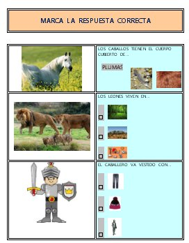

# 2.2 El formulario

Dominado lo más básico del procesador de textos y cómo hacer tablas, estás en disposición de meterte de lleno en la realización de formularios. Recuerda que, especialmente cuando lo mandes al tutor,  en un mismo documento puedes hacer varios formularios. Para ver un ejemplo, pincha en el dibujo de abajo.

