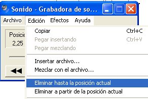
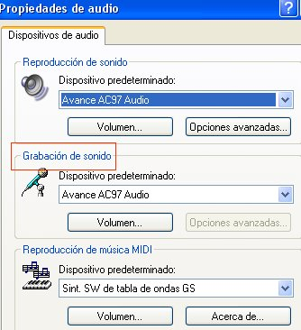

# 2.3.1 Grabadora de sonidos de Windows

fig. 4.18 Eliminar ruidos en la grabadora sonidos Windows. CPP

La Grabadora de sonidos de Windows es la herramienta **más sencilla** de grabación de sonidos. Viene instalada **por defecto** en los equipos con las diferentes versiones del sistema operativo de **Windows.**

Podemos usar la grabadora de sonidos para **grabar** un sonido y **guardarlo** en el equipo como un archivo de audio. Tenemos la posibilidad de  grabar sonidos de **diferentes dispositivos** de audio, como un micrófono conectado a la tarjeta de sonido de su equipo. Los tipos de orígenes de entrada de audio de los que puede grabar dependen de los dispositivos de audio de los que disponga, así como de los **orígenes de entrada** de la tarjeta de sonido. Si tienes algún problema pincha en "Edición", "_Propiedades de audio_" y selecciona en "_Grabación de sonido_" el dispositivo con el que vas a trabajar.

    fig. 4.19 Propiedades de audio del programa de grabación de Windows. CPP

**PASOS PARA LA GRABACIÓN.**

*   Tener un **dispositivo de entrada** de audio conectado al equipo como, por ejemplo, un micrófono.

*   Hacer  clic en el botón Inicio, **accesorios**, entretenimiento, grabadora de sonidos.

*   Clic en **Iniciar grabación.**

*   Para detener la grabación de audio,  clic en **Detener grabación.**

*   Para **seguir grabando** audio, haga clic en Cancelar en el cuadro de diálogo Guardar como y, después, haga clic en Reanudar grabación. Siga grabando el sonido y, a continuación, haga clic en Detener grabación. Para la **versión 2003 es mucho más sencillo**: sólo hay que jugar con el botón de parar y grabar.

*   Clic en el cuadro Nombre de archivo, escriba un nombre de archivo para el sonido grabado y, a continuación, haga clic en **Guardar** para guardar el sonido grabado en un archivo de audio.

*   Para **eliminar los ruidos** pre y pos grabación haz clic en "_Edición_" y selecciona _"Eliminar hasta/a partir de la posición actual_". En el menú efectos hay pocas herramientas, pero la de "_**subir/bajar volumen**_" podría serte de gran utilidad para subsanar defectos de la propia grabación.

Si usas la versión de **Windows 7 o posteriores** verás que grabar es muy sencillo, pero las posibilidades que ofrece son más limitadas que las de versiones anteriores. De todas formas, pincha aquí para ver este sencillo [tutorial ](http://www.ite.educacion.es/formacion/materiales/42/cd/m1_7_6/tutorial_grabador_sonidos_Windows.pdf "Tutorial Grabadora sonidos Windows 7")del ite.educacion. Para versiones **anteriores a Windows 7** mira este [tutorial ](https://www.slideshare.net/learningmusic/tutorial-grabadora-de-sonido-windows-ppt "Tutorial grabadora sonidos 2007")de learningmusic.

   fig. 4.20 Portada tutorial Grabadora sonidos Windows de learningmusic.

**CONVERSIÓN DE FORMATO**

El **problema** más habitual que hay al trabajar con la grabadora de sonidos es el **formato de audio** de los archivos que se generan. La grabadora de sonidos sólo crea archivos **.wav.** Los archivos de audio con extensión .wav son archivos de audio digital normalmente **sin** **compresión** de datos desarrollado y propiedad de Microsoft. 

Al ser de muy buena calidad y, por tanto, pesar mucho, a la hora de compartir estos archivos, cualquier herramienta **2.0** que utilicemos, nos va a **solicitar** un archivo de audio **comprimido,** o lo que es lo mismo, un **archivo mp3.** Por tanto, habrá que convertir el archivo generado a un archivo comprimido.

fig.4.21 Conversor. Softonic

 

fig. 4.22   Logo media.io. Web oficial

Para pasar de un formato .wav a uno .mp3 necesitarás un **conversor de formatos** de audio. Te enlazamos dos, aunque en la red puedes encontrar muchos más, para que te sea tan fácil como pinchar sobre los logos de la izquierda.

