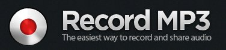
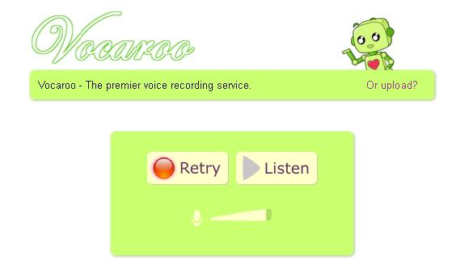
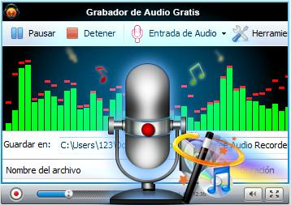

# 2.3.2 Grabadoras de audio online

Las **herramientas web 2.0** han supuesto un avance en cuanto a la oferta de software online, ofreciendo herramientas que **sustituyen a software tradicional instalable**. En este apartado te queremos presentar cuatro herramientas muy interesantes que te facilitarán el proceso de grabación de tus pistas de audio ofreciéndote la ventaja de no necesitar instalado en tu ordenador ningún programa de grabación. 

**1.-** [**ONLINE VOICE RECORDER: **](http://online-voice-recorder.com/es/) es una **sencilla** aplicación gratuita que permite grabar el sonido del micrófono. Además de **grabar,** puedes **cortar** el sonido y **guardarlo** en tu ordenador

**2.- [RECORD MPE](http://www.recordmp3.org/ "Record Mp3. Web convertidor sonidos on line")**. En este caso, lo que te recomendamos es **Record MP3**, una excelente herramienta web en la que podremos grabar tantos minutos de voz como queramos, para poder luego descargar el resultado en un simple** archivo MP3. **

[****](http://www.recordmp3.org/ "Record MP3. Web convertidor sonidos online")

**3[.\- VOCAROO:](http://vocaroo.com/)** Además de las mismas características de de la herramienta anterior, Vocaroo tiene la característica de que genera automáticamente un código embebido que te permite compartir en tu blog o web la grabación de una forma directa.

**4**[**.\- APOWER SOFT AUDIO RECORDER**:](http://www.apowersoft.es/grabador-de-audio-gratis) Una de las herramientas más utilizadas para grabar audios online porque suma a la posiblidad de **grabar** y **compartir** en cualquier espacio web 2,0, la posibilidad de **convertir archivo**s de audio en cualquier formato, lo cual la convierte en una de las herramientas online de audio con **más prestaciones.**

