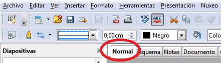
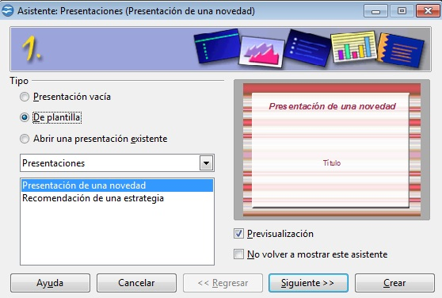

# 2.3 Alternativa: Impress

 

 fig. 5.22 Rótulo Impress. Web oficial de OpenOffice

Es un software libre y gratuito de **OpenOffice**, que ofrece las mismas funcionalidades que su homólogo PowerPoint, aunque con la extensión “.odg” Además, nos permite  cargar y modificar presentaciones hechas con otros editores o crear las  nuestras guardándolas en esos formatos.

Aunque cada vez más gente trabaja con este editor de presentaciones, si no lo tuvieras, y estuvieras interesado en probar nuevos programas, puedes [descargarte](http://download.openoffice.org/index.html "Descarga Impress desde web OpenOffice") el programa desde la web oficial de OpenOffice.

Si has trabajado con otros editores de presentaciones, te será muy intuitivo hacerlo con Impress. Y si no, comprueba las diferencias y semejanzas con Power Point pinchando [aquí](http://es.scribd.com/doc/13629415/Compracion-Impress-Powerpoint-y-Presentacion "Tutorial comparando Impress y Power Point"). De todas formas, sigue las instrucciones de este [tutorial](http://www.catedu.es/facilytic/2013/10/10/presentaciones-impress-y-powerpoint/ "Tutorial Catedu sobre Impress") del Catedu para insertar sonidos e imágenes en las diapositivas.

fig. 5.23 Barra de menús de Impress. Captura de pantalla propia

Para más funciones mírate este sencillo [tutorial](http://www.juntadeandalucia.es/averroes/~21003104/zona_tic/tutoriales/basicoImpress.pdf "Tutorial Juan Andalucía sobre Impress") de la Junta de Andalucía donde podrás aprender cómo:

*   Comenzar seleccionando el tipo de presentación (pgs.6-9)
*   Incluir sonidos (pgs. 19-21)
*   Mostrar presentaciones (pg. 22)
*   Guardar documento (pg. 23)

 Fig. 5.24 Asistente presentaciones de Impres. CPP

