# 2.3 Alternativa: Video Pad

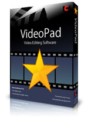    

Este programa **cubre los conceptos básicos sobre cómo editar vídeos**, incluyendo añadir sus archivos multimedia, edición, añadir efectos y transiciones, añadir o ajustar audio o narraciones y finalmente, guardar y exportar sus vídeos. Sin llegar a ser complicado su uso, es más completo que Movie Maker, aunque de formato muy parecido. El único inconveniente es que si no sabes inglés te va a limitar un poco, por lo menos al principio. Para **descargarlo** pincha [aquí ](http://www.nchsoftware.com/videopad/es/ "Descargar VideoPad"). Ten en cuenta que es una versión gratuita cuya **validez es de 15 días**, más que suficiente para que puedas editar tu película.

fig. 6.31  Muestrario de VideoPad. Web oficial de Nch Sofware

fig. 6.32  Barra menús de VideoPad. Captura de pantalla propia

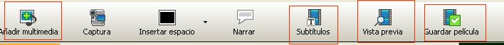

 Básicamente las **funciones que más nos pueden interesar** son las destacadas en la imagen superior:

1.  **Añadir** **multimedia**: para insertar vídeos, imágenes y archivos de sonido.
2.  **Subtítulos**: introducción de texto encima de la diapositiva seleccionada
3.  **Vista previa**:permitirá ver tu edición a tiempo real y en pantalla grande.
4.  **Guardar película**: lo hará en el formato de salida que elijas.

**1\. Añadir multimedia:** Los archivos seleccionados aparecerán en "_Lista de medios"_ y lo que tienes que hacer es arrastrarlos al área de edición de edición: una banda para colocar imágenes y vídeos, y tres para audio. Puedes subir varios archivos a la vez cuando estén en la misma carpeta.

 **2\. Subtítulos.** Previamente tienes que pinchar la imagen, bien sea en cualquiera de las dos ventanas de "Lista de medios", bien en el área de edición

**3\. Vista previa**. Úsala cada vez que quieras ver cómo va quedando tu edición.

**4\. Guardar película.** Tendrás que seleccionar el formato de salida (normalmente será tu ordenador) y seleccionar las diversas opciones que te da de formato de archivo, resolución y velocidad.

Importamos todas las fotos y música a nuestro proyecto de edición.Aunque no hay un **orden** fijo **para trabajar en la edición**, no estaría mal que tuvieras en consideración estas **recomendaciones**:

1.  Colocamos los archivos de imagen en la línea de tiempo.
2.  Insertamos efectos, transiciones y textos.
3.  Importamos los sonidos.
4.  Sincronizamos sonidos e imágenes. Si esto no te interesa, puedes insertar los sonidos cuando quieras.

**0\. Preparación/configuración del proyecto**

*   Ubicar los archivos en el lugar que consideres y personaliza la resolución. Si vas a colgar el video en Youtube te recomendamos una resolución de 340x240.

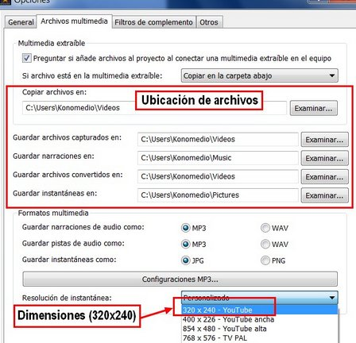

fig. 6.33 Configurar proyecto. Captura de pantalla propia de Julián Trullenque

**1\. Importar clips**

Es conveniente para este tipo de proyectos tener siempre **bien organizados en carpetas los archivos que queremos utilizar** para que no andemos buscándolos por todos los sitios y perdiendo el tiempo.

*   **Clic** en el botón **Añadir Multimedia**.

*   Se abrirá una **ventana**, donde localizaremos los clips de **vídeo, música e imagen**. Seleccionamos todos. Para seleccionar todos los archivos a la vez, hacemos clic en el primero, pulsamos la tecla Mayúsculas y sin soltarla hacemos clic en el último. Ya podemos hacer **clic en Abrir** y se insertarán todos los archivos en nuestro proyecto.
*   Al hacer el clic, veremos que los archivos se han **añadido a nuestro proyecto y aparecen en la lista de medios**..

fig. 6.34. Lista de medios. Captura de pantalla propia

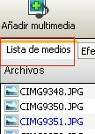

**Arrastrar clips a la línea de tiempo**

Seleccionar el primer **clip y arrastrarlo a la línea de tiempo**. También se puede hacer todos a la vez (tecla Mayúsculas).

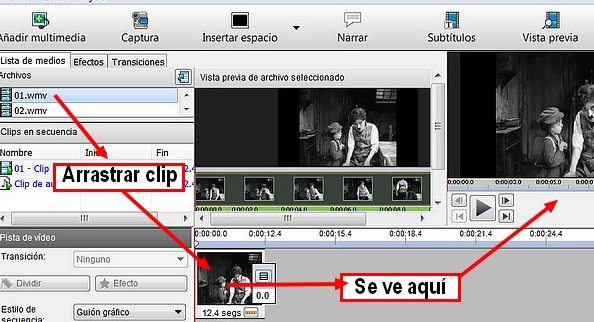  fig. 6.35 Cómo arrastrar clips. CPP de Julián Trullenque

La **duración de cada diapositiva** se puede controlar mediante:

*   La línea (roja) de tiempo del área de edición. Se desplaza con el ratón.
*   El controlador digital

 fig. 6.36 Controlador tiempo clips. CPP

**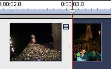**

 fig. 6.37 Línea del tiempo. CPP

*   El mismo procedimiento seguiremos con los **archivos de sonido** para realizar todas las posibilidades descritas para las imágenes.

 **2\. Crear un título**

Videopad no tienen ninguna función especial para crear títulos. Es un programa limitado en este sentido. Lo que deberemos hacer es crear un cuadro en (negro) u otro color, y luego con la función "_Narrar_", crearemos el título.

*   Clic en **Insertar Espacio**.

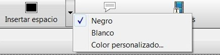

fig. 6.38 Insertar espacio. CPP de Julián Trullenque

*   Aparecerá un **cuadro de diálogo** que nos pregunta, dónde queremos colocar el cuadro negro. Seleccionamos "**Comienzo de la línea de tiempo**".

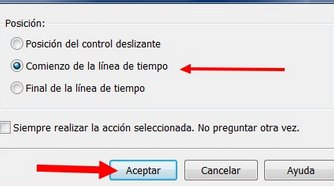   fig. 6.39 Colocar cuadro negro. CPP de Julián Trullenque

*   El espacio en negro que hemos creado dura 3 segundos. Puedes **cambiar la duración del clip** en el marcador de tiempo "_Duración en segundos_" Al final, no olvides pinchar en "Aplicar.

*   Ahora vamos a escribir un título. Hacemos clic en el icono **Subtítulos**.
*   Aparecerá una ventana en la que **escribiremos nuestro texto** " y allí podremos cambiar los atributos del título.
*   Ajustaremos la **duración** para que sea igual que el cuadro en negro que hemos insertado. Para esto haremos clic en "_duración_" y nos aparecerá otro cuadro de diálogo en el que escribiremos la duración.

fig. 6.40 Ingresar duración tiempo. CPP de Julián Trullenque

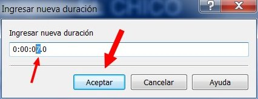

Para hacer los **títulos de créditos finales** haremos lo mismo salvo que **elegiremos "Final de la línea de tiempo"** para colocarlo al final, y luego escribiremos los títulos finales.

**Subtitular películas**.

*   Para iniciar la inserción de subtítulos pulsaremos el **botón "Subtítulos"** en la barra superior.
*   Aparece la ventana **subtítulos** en la que podemos escribir el texto, elegir la configuración, el lugar dónde lo vamos a colocar...
    *   **Iniciamos la reproducción del clip**. Cuando empiece el audio nos fijamos en el progreso del clip. Al finalizar la frase, nos fijamos de nuevo en el progreso del clip. y detenemos la reproducción. Los datos de inicio y fin no tiene que ser exactos.
    *   Pulsamos sobre la zona de escritura del subtítulo y escribimos el texto.

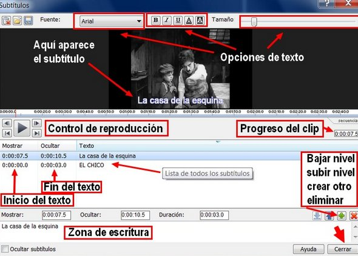

fig. 6.41 Área trabajo para subtitular. CPP de Julián Trullenque

*   Para ajustar el momento en que aparecerá el texto, pulsamos sobre "**Mostrar**". Aparece un cuadro de diálogo en el que podemos ajustar hasta la décima de segundo el momento en que aparecerá el texto. Pulsamos "**Aceptar**" y reproducimos para comprobar el ajuste. Si es correcto vamos al siguiente paso y si no está bien ajustado, volvemos a editar el punto de inicio.
*   Para ajustar el punto en el que se oculta el texto, pulsamos sobre "**Ocultar**" y procedemos de la misma forma que en punto anterior. El proceso hay que repetirlo con cada una de las frases

 **3\. Previsualizar**

Antes de de exportar nuestro trabajo, lo **podemos ver todas las veces que queramos**. Hay dos procedimientos para hacer ésto:

1.  En la **ventana previsualización** del entorno de trabajo (a la derecha).
2.  En la pestaña **Ve**r: Clic en **Vista previa de pantalla competa**

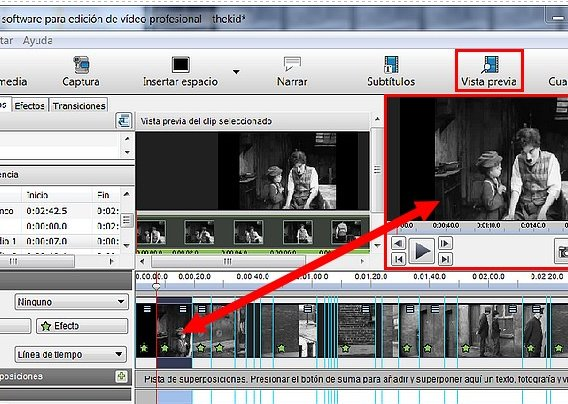 

fig. 6.42 Pantalla vista previa. CPP de Julián Trullenque

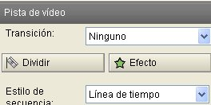   fig. 6.43 Transiciones y efectos. CPP

En nuestra película podemos añadir **efectos y transiciones** para conseguir atractivos efectos visuales. De todas formas, no abuses de ellos. para introducirlos, tienes que seleccionar el clip y elegir en el área de la izquierda.

**4\. Guardar película.** Tendrás que seleccionar el formato de salida (normalmente será tu ordenador) y seleccionar las diversas opciones que te da de formato de archivo, resolución y velocidad. Para hacer esto último tienes que pensar en cómo vas a exhibir la película: mostrarla en clase desde tu ordenador, subirla a youtube, grabarla en un Cd, etc.

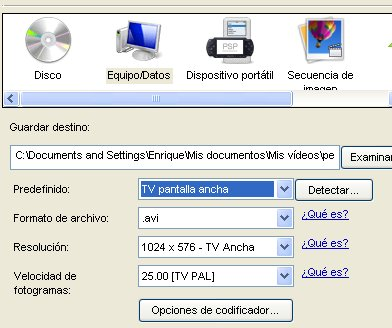  fig. 6.44 Guardar. CPP

Si tienes dudas de cómo trabajar con Video Pad o, simplemente, quieres conocer otras prestaciones te recomendamos este [tutorial ](http://www.slideshare.net/Leonardarijo/video-pad "Tutorial sobre Video Pad")de Leonar Arijo o el videotutorial de Heriberto.

  fig. 6.45 Tutorial sobre Video Pad de Leonar Arijo 

# **Para saber más**

**Doblar el sonido de una película**

**1\. Eliminar sonido**

Puede que hayas insertado algún vídeo y no te interese conservar su sonido. Así es que, antes de doblar el sonido de un clip, debemos aprender a **eliminar el sonido del mismo**.

 fig. 6.46 Área trabajo audio. Captura pantalla propia de Julián Trullenque

Tenemos dos métodos para eliminar el audio:

1.  Bajar el sonido de la pista.
2.  Eliminar todo el sonido.

1. **Bajar el sonido** de la pista.

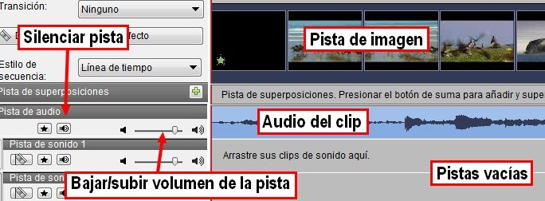  fig. 6.47 Opciones ocultar sonido. Captura pantalla propia de Julián Trullenque

2. **Eliminar** la pista de sonido:

*   **Separar la pista de vídeo** y sonido. Clic con el ratón encima de la pista. Aparece este menú:
*   Al hacer clic observarás que la canción se ha desplazado a la pista de abajo. Si haces otra vez clic con el botón derecho, saldrá este menú, hacemos clic en "**Quitar video seleccionado**" y se eliminará la música.

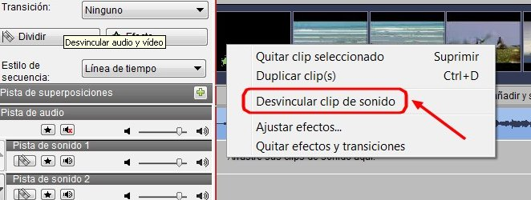   fig. 6.48 Desvincular clip de sonido. Captura pantalla propia de Julián Trullenque

**2\. Grabar narración**

1.  Hacemos **clic en Narrar**. La grabación nos permite ver las imágenes mientras hablamos y esto facilita la coordinación audio-vídeo.
2.  Se abre un grabador de sonidos que, simultáneamente, proyecta el vídeo. El mando de esta grabadora es sumamente intuitivo, los tres botones típicos (“Record”, “Pause” y “Stop”) controlan el proceso. 
3.  Al acabar pulsamos el botón “**Cerrar**” y tendremos un archivo MP3 para incorporar a nuestro vídeo “mudo”.
4.  La pista de **audio quedará incorporada directamente** a la lista de medios (también se guarda en la carpeta que hemos indicado en el proceso).

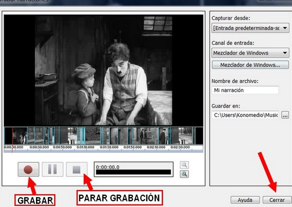 

fig. 6.49 Área de grabación sonidos. Captura pantalla propia de Julián Trullenque

