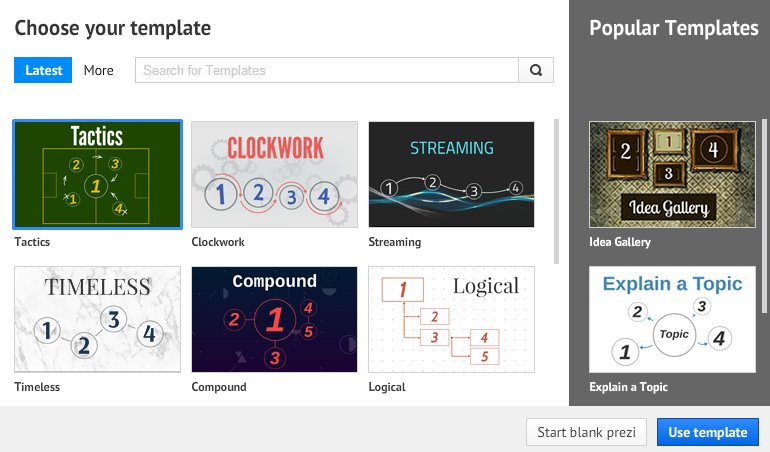
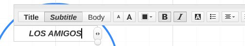
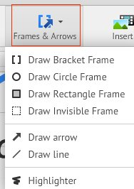
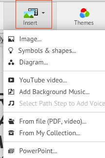
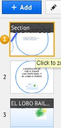

# 2.4 Alternativa on-line: Prezi

   fig. 5.25 Logo Prezi. Web oficial

**E**s una aplicación multimedia on-line para la creación de presentaciones que, a diferencia de otras, lo hace de una manera dinámica y original, dando la posibilidad de organizar la información en forma de un esquema y exponerlo con libertad sin la secuencia tradicional de diapositivas. Para visualizar su novedosa forma de presentar pincha [aquí](http://prezi.com/yqfu-lxm9kxr/tutorial-prezi-en-espanol-aprender-a-utilizarlo-en-15-minutos-academia-prezi/ "Demostración de como funciona Prezi").

Lo primero que tienes que hacer es [registrarte ](http://prezi.com "Página inicio de Prezi")y, una vez terminado el trámite burocrático, entra de nuevo en la página y observarás que está personalizada con tu nombre. Arriba a la derecha pincha sobre “_New Prezi_” y se te abrirá la ventana de "_Choose your template_". Selecciona un modelo de presentación ya hecho para trabajar sobre él o una presentación en blanco.

  fig. 5.26 Modelos de presentación de Prezi. CPP

     fig. 5.27 Editar texto en Prezi. CPP

Para escribir un **texto** haz clic dentro de la figura-marco; elije “_Editar_” y te saldrá un menú para dar formato al texto. Puedes hacer lo mismo haciendo clic sobre _“Add text_” 

 fig. 5.28 Dar formato al texto en Prezi. CPP

 Para operar con Prezi te en cuenta las siguientes **acciones**:

*   Ampliar o reducir el zoom con la rueda del ratón.
*   Arrastrar una figura teniendo pulsado el botón izquierdo del ratón.
*   Agrandar el marco haciendo clic en el borde de la figura  y estirando.

  fig. 5.29 Insertar marcos en Prezi. CPP

Prezi te permite “_**Insertar**_” desde imágenes o Power Points, hasta sonidos y vídeos. Pero para que puedas trabajar con ellos debes tener una figura o **marco** (frames) donde insertarlos. Desde el menú "_Frames and Arrows_" puedes escoger también las flechas que marcan el camino de las diferentes diapositivas.

   fig. 5.30 Insertar archivos en Prezi. CPP

Se pueden crear **nuevas diapositivas** para la presentación siguiendo dos caminos:

*   Haciendo clic en "Add" (izquierda de la imagen)
*   Marcando con el puntero sobre el borde de un marco.

Para **guardar** pinchar sobre "_Share Prezi"_. No olvidar copiar el link, que te permitirá mandar tu presentación por correo o adjuntara a un blog. Si quieres ver un ejemplo pincha [aquí](http://prezi.com/wcr2di-gc0ad/?utm_campaign=share&utm_medium=copy "Presenación Infantil Prezi") o busca dentro del banco de presentaciones que tiene Prezi.

   fig.5.31 Añadir diapositiva en Prezi. CPP

    fig. 5.32 Tutorial sobre Prezi de Thierry Roy. Imagen embebida

Para ampliar o consolidar tus conocimientos de Prezi te recomendamos el **tutorial** de Thierry Roy, donde aprenderás a crear una cuenta, insertar contenido multimedia, compartir y descargar, etc.

