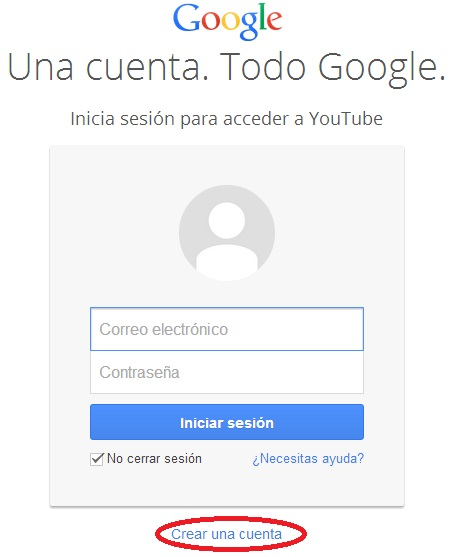
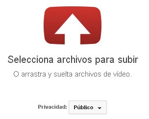
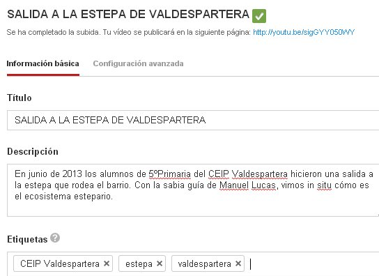

# 2.5 Subir vídeos a Youtube

El vídeo que acabamos de hacer, por poco que pese, nos va a ocupar cierto espacio en nuestro ordenador y va a ser difícil colgarlo en un blog o en una web. Así que necesitamos un  buen **servidor donde almacenar nuestros videos** y desde allí bajarlos embebidos o enlazados a nuestra blog/web, o para que la gente lo vea directamente desde la galería de vídeos. Hoy por hoy, el gran servidor de almacenamiento de vídeos lo ofrece [Youtube](http://www.youtube.com/ "YouTube").

    

 El primer paso es entrar en YouTube y **darse de alta**. Pincha en , y se te abrirá una ventana como la que ves, en la que tendrás que pinchar sobre "_Crear nueva cuenta_". Hay que rellenar todos los campos que nos solicita. Puedes dar tu correo de gmail o cualquier otro. Una vez finalizado el proceso, YouTube enviará un correo electrónico para informar de que has sido dado de alta. Apunta bien el nombre y la contraseña.

**Terminada la creación de la cuenta**, si abres YouTube desde tu ordenador, automáticamente aparecerá tu nombre como indicativo de que estás en tu propia página inicio de YouTube.

Es tiempo ya de **subir el vídeo** que habíamos grabado –recomendable no más de 15 minutos de duración. Para ello pincha en  y cumplimenta el formulario que se abrirá. Al final no olvides pinchar en "_Subir un vídeo_". Dependerá de los MBs que ocupe la película, pero el proceso  de subida de vídeos suele tardar unos minutos.

   

Durante el proceso de subida se abrirá una ventana de "_**Información básica**"_. Rellena todos los datos con precisión porque dicha información, especialmente la del apartado "_Etiquetas_",  será usada por los futuros espectadores para localizar los vídeos. Tampoco olvides seleccionar la categoría.

  

Al final del proceso, YouTube te mostrará la **dirección URL de** tu vídeo.([http://youtu.be/sigGYY050WY](http://youtu.be/sigGYY050WY)). Cópiala  y úsala para incluirla en tu blog o web, o para adjuntársela en un correo a un amigo o a tu tutor. Si quieres ver el resultado final del proceso, es decir, un vídeo, haz clic sobre la URL que hemos puesto antes.

Para **conocer un poco más** de este gran servidor de vídeos, especialmente sus posibilidades para educación, te recomendamos el siguiente [manual](http://facilytic.catedu.es/2013/10/19/youtube/ "Manual sobre utilidades de Youtube") del Catedu. 

