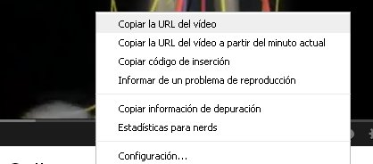

# 3.2 Cómo seleccionar

**Posibilidades** a la hora de seleccionar un vídeo:

1- **Copiar su URL.**

2- **Descargarlo.** (ver [apartado 3.3](33_descargar_vdeos.html))

## **Copiar la URL**

Te va a resultar más fácil, aunque tiene el inconveniente de que los vídeos colgados en internet no son para toda la vida y, además, vas a depender de tener operativa la conexión a la red. Sigue los siguientes **_pasos_**:

**a)** Pincha con el botón derecho del ratón sobre la imagen del vídeo seleccionado, y selecciona "_Copiar la URL del vídeo_". En algunos buscadores, como TeacherTube, la dirección ya te viene dada en la parte inferior; sólo tienes que seleccionarla y copiarla.

**b)** En un documento, por ejemplo, un Word, pega la URL, y no olvides escribir algo sobre el vídeo. Date cuenta de que el entramado de cifras y letras de la URL no te va a decir nada sobre su contenido. Recuerda que la URL no se activa hasta que pulses el tabulario para dejar un espacio detrás del último signo de la dirección.

También puedes hipervincular la dirección URL a una imagen o a una palabra, tal como hacemos nosotros a lo largo de este curso de TIC en Educación Infantil. Para ello, selecciona la palabra o imagen, pincha botón derecho, selecciona "_Hipérvínculo_" y pega la dirección que corresponda. Puedes hacer lo mismo si vas al menú "_Insertar_", "_Hipervínculo_".

