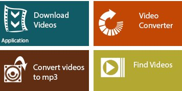
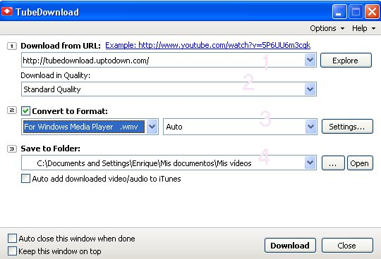

# 3.3 Descargar vídeos

**Descargar un vídeo** tiene la **ventaja** de que el vídeo será tuyo para siempre y lo podrás poner sin necesidad de estar conectado a la red. La **desventaja** es que te va a ocupar mucho espacio. Se recomienda sólo usar esta opción para vídeos muy interesantes, y que te dolería que desaparecieran de la red.

Mandar vídeos descargados al tutor va a resultar imposible por la gran cantidad de Mbs que ocuparía el archivo. Así, pues, lo más lógico es que le mandes la URL de los mismos. Esto no implica que no sigas leyendo este punto porque la información que se te ofrece la necesitarás algún día para tu práctica diaria.

>**info**
>## Importante
>
>Hay muchas maneras y formas de descargar vídeos de Internet. Nosotros te recomendamos que aprendas y te familiarices con la o las que más te convenzan y que no es necesario aprenderlas todas. **Las distintas formas de descarga de vídeos en Internet son**:
>
>*   Algunas páginas tienen **descarga directa** , por ejemplo Vimeo (si estás registrado).
>*   Instalando una **extensión o plugin** en el navegador. Es muy cómodo, lo instalas una vez y no tienes que ejecutar programas. Tiene el inconveniente de que al cambiar las versiones del nevegador, pueden dejar de funcionar esos complementos.
>*   **Páginas web**, que solo con copiar la dirección del vídeo lo descargan.
>*   **Utilizando  trucos**, yendo a la memoria caché de los navegadores. Es la más complicada.
>*   Utilizando **un programa de gestión de descarga de vídeos**. Es la recomendada y sobre la que vamos a trabajar. Utilizaremos el programa **aTube Catcher**.
>
>_Julián Trullenque. Aularagón_

A continuación te explicamos dos programas gratis para descargar vídeos, pero si pinchas [aquí](http://www.catedu.es/aularagonpowerpoint/TEMATICOS/VIDEOYFLASH/comobajarvideos.html "Galería programas descarga vídeos") te darás cuenta de que hay muchos más en el mercado. **Escoge el que te guste más** y úsalo cuando las circunstancias así lo requieran.

## **1\. aTube Catcher**

**"aTube Catcher"** es un programa gratuito; una excelente opción con la que podremos **descargar vídeos** de nuestras páginas webs favoritas (YouTube, Dailymotion, MySpace, Stage6,Google, etc.). Posee otras posibilidades como convertidor de formatos de vídeos, capturador de pantalla, creador de DvDs, grabadora (interesante para el Módulo 4), etc. Pero nosotros nos vamos a centrar en descargar vídeos.

**1\. Descargar e instalar el programa**

1.  Ir a [http://atube-catcher.dsnetwb.com/video/](http://atube-catcher.dsnetwb.com/video/)
2.  Hacer clic en "[Descargar gratis](http://get.atube.me/aTubeCatcher.exe)"
3.  Una vez descargado, hacer doble clic en **aTubeCatcher.exe**
4.  Seguir las instrucciones hasta instalar el programa.

 **2\. Descargar un vídeo de la red**

**1º Buscar el vídeo.** Lo puedes hacer externamente al programa, por ejemplo, desde un buscador como Youtube, o desde el mismo programa aTube Catcher. Para ello, abre el programa y pincha sobre "_Find videos_"; escribe dentro de la zona lo que quieres buscar e Intro. Sobre el vídeo que te interese, botón derecho "_Copiar URL_"

**2º Descargar el vídeo**. Pegamos la dirección URL en el campo de formulario "_URL del vídeo_"; seleccionamos el formato en "_perfil de salida_" y pinchamos en "_Descargar_".

Antes de descargar, no olvides pinchar en "_Guardar en_" para ubicar el vídeo en la carpeta que tú quieras, no la que quiera el ordenador por defecto.

**Resumiendo** en un sólo golpe de vista, observa la imagen de abajo.

## **2\. TubeDownload 2.7.1**

 

**[TubeDownload 2.7.1](http://tubedownload.uptodown.com/ "Descargar Tubedownloader") **es otro programa -hay más- para descargar vídeos. Es una aplicación gratuita para Windows,  muy fácil de usar, y cuya única función es la de descargar vídeos. 

La aplicación funciona de manera sencilla. Basta con copiar la dirección URL de la página de Youtube donde se muestra el vídeo y pegarla en el recuadro correspondiente **(1)**. A partir de ahí sólo tendrás que escoger la calidad del vídeo **(2),** el formato al que lo quieres convertir **(3)**, y dónde lo quieres guardar **(4)**.

