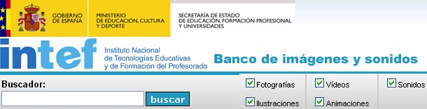

# Ampliación de contenidos

## ParaSaberMas

*   Documento de Aularagon que trata los **aspectos básicos del sonido**: formatos, soportes, etc.

[http://www.aularagon.org/Files/UserFiles/File/Forprof/Hm/modulo-01.pdf](http://www.aularagon.org/Files/UserFiles/File/Forprof/Hm/modulo-01.pdf)

 

*   **Banco de sonidos del INTEF**_. Ministerio de Educación. _Repositorio de sonidos organizado por categorías, aunque también de fotografías, ilustraciones, vídeos y animaciones.

  fig.4.27 Página Inicio de Intef. Captura propia de pantalla

[http://recursostic.educacion.es/bancoimagenes/web/](http://recursostic.educacion.es/bancoimagenes/web/)

*   Paola Allendes nos muestra cómo **grabar sonidos con Audacity desde internet**

 [http://www.youtube.com/watch?v=89O0bVgFFzI](http://www.youtube.com/watch?v=89O0bVgFFzI) 

*   **Versión portable de Audacity**

    fig. 4.28 Portable apps . Licencia Creative Commons

Cada vez son más **frecuentes** las versiones **"portable"** de software. Estas versiones permiten llevar el programa instalado **en memorias externas** de manera que podremos siempre hacer uso de él aunque en el ordenador que estamos utilizando no esté instalado el programa. Así, pues, con conectar el** usb**, tendremos el programa a nuestra disposición.

En este [enlace](http://audacity-portable.softonic.com/) podrás descargarte la versión** portable de Audacity ** que nos ofrece las mismas características que su versión instalable.

