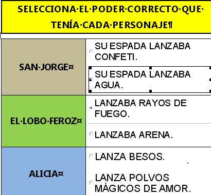
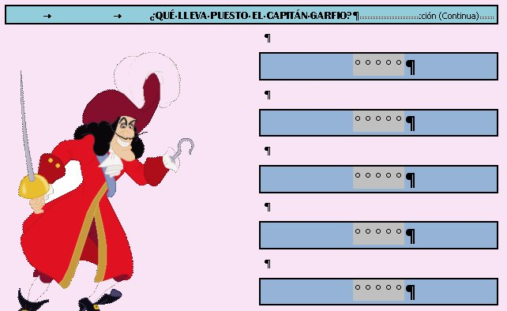

# Contenidos

*   Unidad 1:**Reelaborando la información en los Proyectos de Trabajo.**
    *   1.1. Reelaborar en los Proyectos de Trabajo.
    *   1.2. Nuestro Proyecto de Trabajo.
    *   1.3. Las TIC en nuestro Proyecto de Trabajo.
*   Unidad 2: **Los Formularios**

*   2.1 Herramientas de uso previo
    *   2.1.1 El procesador de textos.
    *   2.1.2 Las tablas
*   2.2. El Formulario.

*   2.2.1 El formulario en Word
*   2.2.2 El formulario en Oppenoffice
*   2.2.3 El formulario on-line en Google Drive

*   Unidad 3:**Entrega al tutor.**

fig. 3.1 Actividad de formulario. Mª Cambra. CPP   fig. 3.2 Actividad de formulario. Mª Cambra. CPP

 

 

