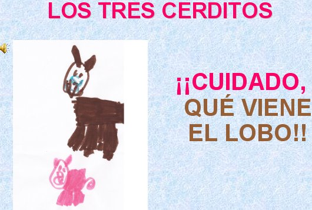

# Contenidos

### Unidad 1: **Actividades en los Proyectos de Trabajo.**
*   1.1. Actividades en los Proyectos de Trabajo.
*   1.2. Nuestro Proyecto de Trabajo.
*   1.3. Las TIC en nuestro Proyecto de Trabajo.
### Unidad 2: **Edición de presentaciones.**
*   2.1 Pasos previos: sonido e imagen
    *   2.1.1 El sonido
    *   2.1.2 La imagen
*   2.2 Power Point
    *   2.2.1 Insertar texto e imágenes.
    *   2.2.2 Insertar sonidos y presentación
*   2.3. Alternativas a P.Point: Impress y Prezi

### Unidad 3:**Entrega al tutor.**

 

 

