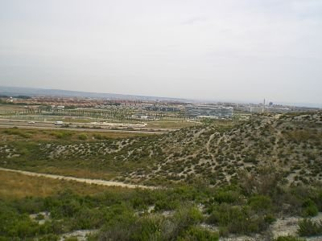

# Contenidos

*   Unidad 1: **Actividades en los Proyectos de Trabajo.**
    *   1.1. Actividades en los Proyectos de Trabajo.
    *   1.2. Nuestro Proyecto de Trabajo.
    *   1.3. Las TIC en nuestro Proyecto de Trabajo.
*   Unidad 2: **Edición de vídeos**
*   2.1 Consideraciones previas
*   2.2. MovieMaker
    *   2.2.1 Imágenes, vídeos y sonidos
    *   2.2.2 Transiciones, efectos y créditos
    *   2.2.3 Guardar y crear película
*   2.3 VideoPad: alternativa para crear vídeos
*   2.4 Subir vídeos a Youtube

*   Unidad 3:**Entrega al tutor.**

 

fig. 6.1 Clip película "La estepa de Valdespartera" EPR

 

