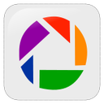

# M1. GALERÍAS DE IMÁGENES Y VIDEOS

Ahora sí que empieza propiamente el desarrollo del contenido del curso. Este primer módulo es, posiblemente, el más sencillo, aunque con el mayor número de tareas a realizar. Sigue las instrucciones paso a paso; adapta lo que creas necesario; y elige las herramientas que te resulten mejor.

## Objetivos

*   Seleccionar galería de videos y catálogos de imágenes web de carácter libre en los que poder encontrar recursos audiovisuales.

## Galería de imágenes

