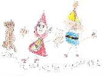

# M4. Edición de sonidos

En este módulo nos vamos a centrar en el **mundo imaginario** creando, recreando o reproduciendo una historia, cuento o leyenda. Aunque no va a ser el único modo de hacerlo, intentaremos especialmente que los niños **creen su propia narración** y la vean reproducida sonoramente. Así, pues, para trabajar la expresión oral utilizaremos un **editor de sonidos**. Si pinchas sobre la imagen oirás un **ejemplo** de lo dicho.

## Objetivos

*   **Grabar, tratar y exportar sonidos utilizando una herramienta de grabación de audio**
