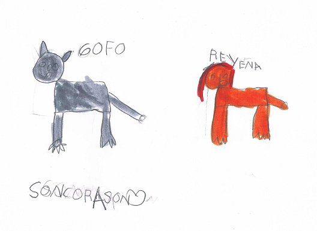

# M.5 EL EDITOR DE PRESENTACIÓN DE DIAPOSITIVAS

   

En el anterior módulo creamos, recreamos o reprodujimos una historia e hicimos las grabaciones de  audio correspondientes. Ahora cogeremos este material, lo uniremos a unos textos y unas imágenes, y realizaremos una presentación utilizando un **editor de presentaciones**.

Como en anteriores módulos te vamos a mostrar varias **opciones** para que hagas la presentación más adecuada: desde programas como Power Point e Impress a aplicaciones on-line como Prezi. Tú elijes la herramienta que mejor te vaya, y con ella mandarás las actividades al tutor. De todas formas, a corto o medio plazo, no olvides echar un vistazo a aquellos caminos que has dejado de explorar.

## Objetivos

*   **Crear una presentación con diapositivas que contenga imagen, texto y sonido.**

