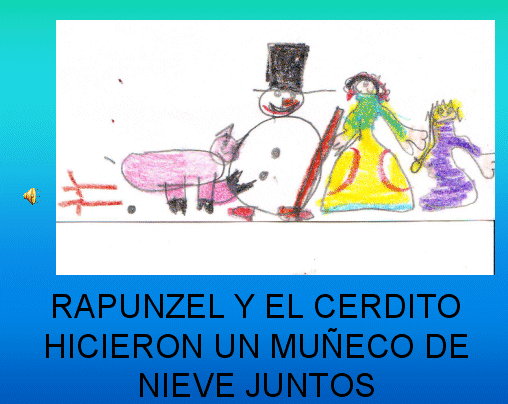

# U1. Actividades en los Proyectos de Trabajo

## Objetivos

*   **Crear una presentación con diapositivas que contenga texto, imágenes y sonidos.**

## Importante

Fig. 5.3   Diapositiva PPT _"El cerdito que no paraba de correr_" MªVictoria Hernando

Las actividades en los Proyectos de Trabajo deben ayudar a nuestro alumnado a **profundizar** en la pregunta clave o el tema.

Con este módulo pretendemos que el profesorado genere una **actividad que englobe la expresión escrita y oral** con la artística para reforzar el conocimiento del alumnado sobre el cuento, historia o leyenda que han creado: estructura de la narración, características de los personajes, etc. Oír sus propias voces, ver sus dibujos y leer sus textos también ayudará a materializar el trabajo hecho anteriormente y, por tanto, a ilusionar con el trabajo bien realizado. 

