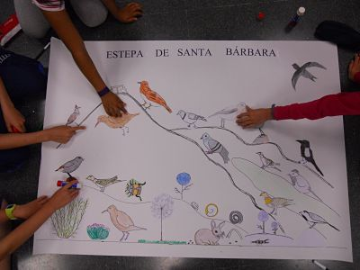

# U1. Evaluar en los Proyectos de Trabajo

## Objetivos

*   **Editar una película utilizando las imágenes, información y sonidos elaborados durante todo el proyecto.**

## Importante

 

Fig. 6.2   Mural Ecosistema Estepa. CEIP Valdespartera. EPR

Evaluar en los Proyectos de Trabajo debe ayudar a nuestro alumnado a mejorar su **metacognición**, es decir, a reflexionar el cómo, cuándo, dónde, con quién y qué de su aprendizaje.

Con este módulo pretendemos que el profesorado genere una actividad a través de la edición de un vídeo que englobe todo lo realizado durante todo el proyecto de trabajo. Volver a ver y comentar lo vivido ayudará a que sean conscientes, entre otras cosas, de lo que supone aprender.

