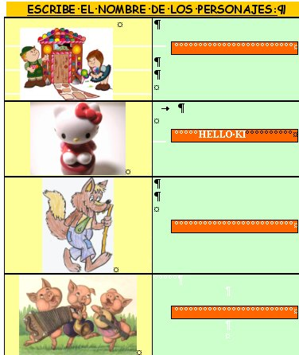

# U1. Reelaborando la información en los Proyectos de Trabajo

## Objetivos

*   **Elaborar formularios.**

## Importante

Fig. 3.3   Formulario Campo Texto. Ana Navarro y Enrique Pérez

El **tratamiento de la información** en los Proyectos de Trabajo, como en cualquier proceso de investigación, se convierte en una fase decisiva que determina lo que nuestro alumnado va a aprender.

Con este módulo tan sólo pretendemos que el profesorado **reelabore la información** anterior a través de las nuevas informaciones que surjan del nuevo ámbito que se va a trabajar: el mundo de la ficción. Y sintetizando todo ello mediante la creación de formularios.

