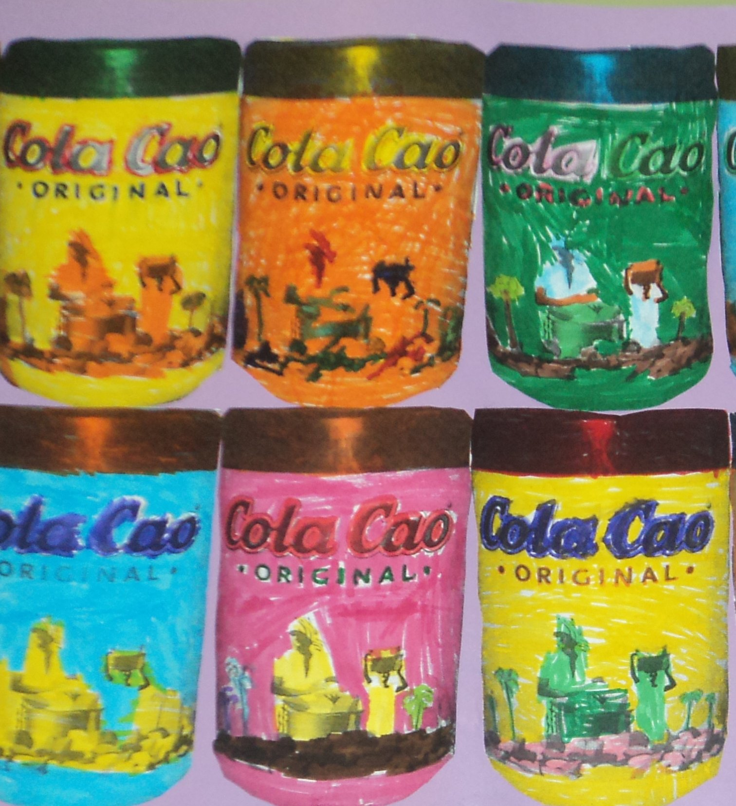

# U1. TIC y Proyectos de Trabajo

## Importante

*   **Trabajar por proyectos ****no es sólo una metodología** de enseñanza-aprendizaje, aunque lo vamos a tratar como tal a lo largo del curso.
*   **Usar las TIC no es estrictamente necesario** para desarrollar ningún Proyecto de Trabajo, pero los campos de información y conocimiento que nos ofrecen, nos obligan a tenerlas en cuenta.

 

