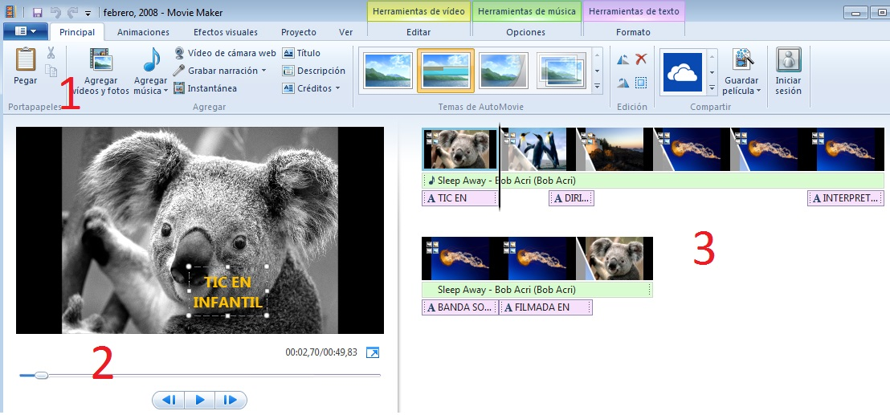
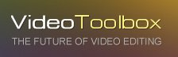
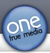

# U2. Edición de vídeos

## Objetivos

*   ****Editar una película utilizando las imágenes, información y sonidos elaborados durante todo el proyecto.****

La **Wikipedia**: define la edición de vídeo como “_un proceso en el cual un __editor __elabora un trabajo __audiovisual a partir de medios que pueden ser archivos de sonido, video, fotografías, gráficos, o animaciones.__”_

**Ventajas**:

*   No dependen necesariamente de Internet.
*   A nivel básico su funcionamiento no es difícil.
*   No ocupan mucho en el disco, aunque a veces pueden ralentizarse.
*   Posibilidad de utilización también con PDA y Pizarras Digitales Interactivas.

Desde el punto de vista **educativo** :

*   Posibilidad de añadir nuevas imágenes/sonidos a lo largo de la edición.
*   Interesante y motivador para el niño al verse reflejado en el vídeo
*   Exportable al resto de la comunidad escolar.

        fig. 6.6 Ventana edición Movie Maker.CPP

Como ya habréis visto en el guión de este módulo, vamos a incidir en Moviemaker como editor de vídeo preferente, aunque en el apartado 2.3. veremos otras posibilidades. De todas formas, si quieres explorar otros editores, te recomendamos la web de [Wondershare ](http://www.wondershare.es/video-editor/free-video-editing-software-windows.html "Los 10 mejores editores de vídeo del mundo")para que veas cuáles son, según su criterio, los **10 mejores programas gratuitos** de edición de vídeos.

# **Para saber más**

Hay usuarios que prefieren usar las **aplicaciones online** para editar sus videos, sin tener que descargar o instalarlas algo. Aquí te presento algunas aplicaciones en linea para editar los vídeos:

    fig. 6.7 Cartel VideoToolbox. Web oficial

Puedes unir los archivos automáticamente o usar las herramientas de edición ofrecidas por la aplicación. También puede capturar vídeo de tu cámara. Claro, que la calidad del vídeo capturado depende de la conexión de Intenet. Para usar esta aplicación es necesario registrarse.

    fig. 6.8 Cartel Cellsea. Web oficial

No tienes necesidad de crear ninguna cuenta. La aplicación te envía a la pagina de edición, donde puedes usar algunas herramientas muy básicas. Al ser un editor tan simple, puedes preparar tus videos para usarlos en otros servicios. Después de cargar tu vídeo lo puedes convertir en el formato necesario o crear URL con el acceso directo a tu vídeo.

 fig. 6.9 Logo Creaza. Web oficial

Permite no solo editar vídeos online, pero también compartir tus vídeos en linea, y, sobre todo, puedes editar el vídeo en conjunto con otros usuarios. Es posible recortar, mezclar y añadir una pista de audio para tu vídeo. Es necesario registrarse.

 fig. 6.10 Logo YouTube. Web oficial

Puedes trabajar con una interfaz bien conocida y no te perderás dentro de las opciones disponibles, ya que son solo las opciones mas básicas.

 fig. 6.11 Logo One true media. Web oficial

Puedes crear vídeos estupendos mezclando fotos, vídeos con efectos, música y texto. Es muy fácil de utilizar. Necesitamos registro

