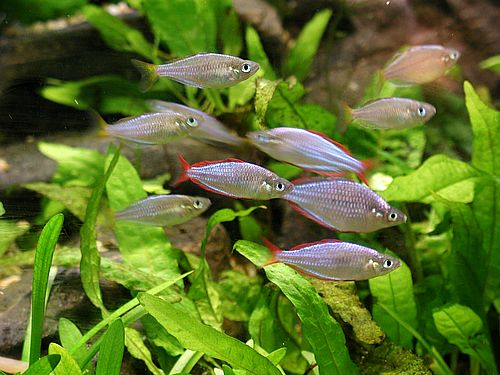

# U2. Álbum de imágenes

## Objetivos

**1\. Seleccionar imágenes a través de páginas web y buscadores.**

## **Importante:**

Siguiendo la estructura de un proyecto, realizaremos una **actividad de motivación** en la asamblea. Presentaremos a nuestro alumnado lo que vamos a hacer a lo largo del proyecto; les expondremos una serie variada y extensa galería de imágenes de animales para que elijan el grupo  (salvajes, domésticos, granja u otros) que les parece más interesante. Las imágenes deben ser reales y de calidad.

fig. 1.6 Detalle Peces en el Acuario. Public Domain. Zaha-Hadid

 

