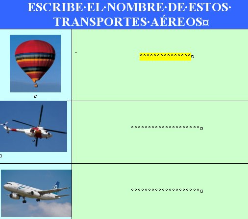

# U2. Los formularios

## Objetivos

*   **Elaborar actividades de Formulario.**

La tercera acepción de la **RAE** de formulario nos dice “_impreso con espacios en blanco_”, a lo que habría que añadir la definición de la **Wikipedia**: “_con el propósito de que el usuario introduzca datos estructurados (nombre, apellidos, dirección, etc.) en las zonas del documento destinadas a ese propósito para ser almacenadas y procesadas posteriormente_”.

                                                                          fig. 3.7 Actividad formulario Campo de texto. Cristina Altaba

**Ventajas**:

*   No dependen necesariamente de Internet.
    
*   Pueden generar una base de datos de los resultados
    
*   Posibilidad de utilización también con PDA y Pizarras Digitales Interactivas.
    

**Desde el punto de vista educativo:**

*   Centra al alumno en lo que se le pide.
    
*   Entorno agradable  y actividades atractivas, aunque no demasiado variadas. .
    
*   Facilidad de uso y sin necesidad de preparar los ordenadores.
    
*   Creación de actividades de forma sencilla..
    

